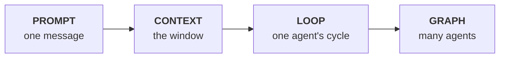

# Your-Augmented-Colleague

**Learn how to treat AI as your ultimate digital teammate.** A beginner-friendly resource
hub helping non-technical teams collaborate with AI to work smarter, not harder.

Built for CGP — recruitment consultants, business developers, and the HQ operations layer
of the outsourcing team. People who work with documents, approvals and deadlines, not code.

---

## ⚠️ Disclaimer

> **This is a teaching and demonstration repository. It is not a live operational system.**
>
> - All projects, milestones, candidates, clients, incidents and figures are **fictional**,
>   written to demonstrate structure and method.
> - It contains **no real candidate, client, or project data**, and none should ever be
>   added — this repository is **public**.
> - **IMDA** (Infocomm Media Development Authority) is referenced because CGP's outsourcing
>   team operates in Singapore's public-sector space. Nothing here describes, represents, or
>   is endorsed by IMDA or any government agency.
>   [`projects-imda/IMDA-DELIVERABLES.md`](projects-imda/IMDA-DELIVERABLES.md) is a
>   **structural example built on invented data**.
> - Compliance content summarises publicly available guidance for **educational purposes**.
>   It is **not legal advice** and must be verified with Legal and the DPO before any
>   operational reliance.
> - Real operational documents belong in a **private** repository with access controls.

---

## What this repository teaches

Two things, taught as one subject:

1. **How to use AI well** — beyond typing into a chat box. Prompt → context → **loop** →
   **graph** engineering, with a heavy deep dive into the last two.
2. **How to use GitHub as an operations tool** — version control, review gates and audit
   trails for teams that have never written code.

They belong together because the second is what makes the first stick. A great prompt in
someone's private chat history is worth nothing to the firm. The same prompt in a
versioned, reviewed repository is an asset the whole desk inherits.

### The problem, in two numbers

| | |
|---|---|
| **66%** | of knowledge workers using AI say it lets them spend more time on high-value work *(Microsoft Work Trend Index 2026, n=20,000)* |
| **89%** | of firms measured **zero** productivity impact *(study of 6,000 executives)* |

Both are true at once. Individuals get faster; organisations mostly do not. **That gap is
what this repository exists to close** — and it is a systems problem, not a tooling problem.
Everyone has the same models. [Sources](learn/06-EVIDENCE-PACK.md#c-adoption-and-productivity).

---

## 🎤 The slide deck

**[▶ Beyond the Prompt](slides/index.html)** · 14 slides, ~25 minutes ·
**[Speaker notes](slides/SPEAKER-NOTES.md)**

Plain language, for people who already use AI at work but have no technical background.

**The slides are a backdrop, not a script** — a headline and one idea each, about 55 words.
The [speaker notes](slides/SPEAKER-NOTES.md) are short cues rather than paragraphs: four to
six lines per slide covering the analogy to use, the question to ask the room, and the
objection to pre-empt. Glance at them, don't read them. Every idea is carried by a worked
recruitment, business development or operations example.

Open [`slides/index.html`](slides/index.html) in any browser — no installation, no
dependencies, works offline.

| Key | Does |
|-----|------|
| `←` `→` or space | Move between slides |
| `N` | Show or hide speaker notes on screen |
| `P` | Print, or export to PDF (notes included under each slide) |

Covers: why saved prompts matter more than clever ones · giving AI the right material ·
loops and why every loop needs a check · the five ways of checking work · how small error
rates multiply · when to start a fresh chat · why AI projects fail · graphs explained
simply · approving before rather than after · the compliance floor. Every figure is cited
in the [Evidence Pack](learn/06-EVIDENCE-PACK.md).

---

## 🚀 Start here

| If you are… | Go to |
|---|---|
| **Presenting to the team** | [The slide deck](slides/index.html) |
| **New to all of this** | [learn/00-START-HERE.md](learn/00-START-HERE.md) |
| **Short on time (1 hour)** | [Context](learn/02-CONTEXT-ENGINEERING.md) → [Loop](learn/03-LOOP-ENGINEERING.md) → [Evidence](learn/06-EVIDENCE-PACK.md) |
| **Presenting to leadership** | [Evidence pack](learn/06-EVIDENCE-PACK.md) + [Stack compared](learn/05-THE-STACK-COMPARED.md) |
| **Looking for a specific document** | [INDEX.md](INDEX.md) |
| **About to use AI on real work** | [compliance/COMPLIANCE.md](compliance/COMPLIANCE.md) — **first** |
| **New to GitHub entirely** | [learn/07-GITHUB-FOR-NON-CODERS.md](learn/07-GITHUB-FOR-NON-CODERS.md) |

---

## 🧠 The learning track

The core of this repository. Four rungs, each a level up in what you design.



| | Document | What it covers |
|---|---|---|
| 00 | [Start Here](learn/00-START-HERE.md) | Why this exists, the four rungs, ground rules |
| 01 | [Prompt Engineering](learn/01-PROMPT-ENGINEERING.md) | The floor. Anatomy, techniques, limits |
| 02 | [Context Engineering](learn/02-CONTEXT-ENGINEERING.md) | Write · Select · Compress · Isolate. Context rot |
| 03 | [**Loop Engineering**](learn/03-LOOP-ENGINEERING.md) 🔍 | **Deep dive.** Trigger · topology · verifier · stop rule. Maturity ladder |
| 04 | [**Graph Engineering**](learn/04-GRAPH-ENGINEERING.md) 🔍 | **Deep dive.** State · nodes · edges. Checkpointing. Human gates |
| 05 | [The Stack Compared](learn/05-THE-STACK-COMPARED.md) | Decision tables. When to use which |
| 06 | [**Evidence Pack**](learn/06-EVIDENCE-PACK.md) 📊 | **Every statistic, sourced. Build slides from this** |
| 07 | [GitHub for Non-Coders](learn/07-GITHUB-FOR-NON-CODERS.md) | Repos, branches, PRs, issues — in ops language |

### The three ideas that matter most

**1. Loop engineering was named in June 2026** — after essays by
[Addy Osmani](https://addyosmani.com/blog/loop-engineering/) and a viral line from Peter
Steinberger. It is the practice of designing the system that *prompts, verifies, retries
and stops* an agent, rather than doing it turn by turn yourself. It emerged not because
models got smarter, but because **prompt-by-prompt supervision stopped scaling with review
capacity** — which is precisely the constraint on an HQ operations team.

**2. Reliability compounds downward.** At 95% per-step accuracy, a 10-step workflow
succeeds **59.9%** of the time. That is arithmetic, not pessimism, and it is why verifiers
and human checkpoints are structural necessities rather than bureaucracy — a verified human
checkpoint **resets** accumulated error.

**3. The failures are architectural, not intellectual.** Over **60% of production agent
incidents are state-management failures.** The constraint is not model intelligence; it is
state, verification and error compounding — all three solvable by design.

---

## 🏛️ Governance & compliance

| Document | Purpose |
|---|---|
| [compliance/COMPLIANCE.md](compliance/COMPLIANCE.md) | Data classification, the NRIC rule, approved tools, redaction, AI decisions about people |
| [compliance/data-governance.md](compliance/data-governance.md) | Systems map, retention, access control, incident response, vendor AI clauses |
| [WORKFLOW.md](WORKFLOW.md) | SOPs — vendor approval, milestone sign-off, handover, AI-assisted production, change control |

**The rule that resolves most questions:**

> Would you be comfortable if this exact text appeared in a regulator's file, attributed to
> CGP, with the client's name attached? If not, it does not go into an AI tool.

**Never in any AI tool:** NRIC/FIN, passport numbers, candidate contact details, dates of
birth, medical information, or client-confidential commercial terms in a consumer account.

---

## 👥 Playbooks, projects & templates

| Document | Purpose |
|---|---|
| [playbooks/RECRUITMENT.md](playbooks/RECRUITMENT.md) | 8-stage hiring pipeline, screening controls, evaluation criteria, onboarding |
| [playbooks/BIZ-DEV.md](playbooks/BIZ-DEV.md) | Tender pipeline, qualification scorecard, bid/no-bid gates, pricing checks |
| [projects-imda/IMDA-DELIVERABLES.md](projects-imda/IMDA-DELIVERABLES.md) | *(Demo)* Milestone tracker, acceptance criteria, issue cross-referencing |
| [projects-imda/audit-logs.md](projects-imda/audit-logs.md) | *(Demo)* Audit trail, AI usage log, incident log |
| [templates/rfp-response-v1.md](templates/rfp-response-v1.md) | Full RFP response structure + compliance matrix |
| [templates/candidate-eval-v1.md](templates/candidate-eval-v1.md) | Anonymised scoring sheet with fairness checks |
| [PROMPTS.md](PROMPTS.md) | Shared prompt library — reusable blocks + 8 working prompts |
| [INDEX.md](INDEX.md) | Master file map |
| [CHANGELOG.md](CHANGELOG.md) | Audit trail of changes to this repository |

---

## 🗺️ Structure

```
├── .github/ISSUE_TEMPLATE/     Standardised intake forms
├── learn/                      ← The AI learning track (start here)
├── compliance/                 Data classification, PDPA, governance
├── playbooks/                  Recruitment and BD operating procedures
├── projects-imda/              Demo milestone tracker + audit logs
├── templates/                  RFP response, candidate evaluation
├── INDEX.md                    Master file map
├── PROMPTS.md                  Shared AI prompt library
├── WORKFLOW.md                 SOPs with approval gates
├── CHANGELOG.md                Change audit trail
└── README.md                   You are here
```

---

## 💡 What to actually do on Monday

Concrete, in order — and the first three cost nothing but discipline:

1. **Read** [00-START-HERE](learn/00-START-HERE.md) and [COMPLIANCE](compliance/COMPLIANCE.md). *30 min.*
2. **Write down one process** you repeat weekly, as numbered steps. *That is rung 1.*
3. **Write its verification checklist** — what does "done correctly" mean? Which of those
   checks are mechanical? *This is the hard part, and it needs no technology.*
4. **Put your best prompt in [PROMPTS.md](PROMPTS.md)** via a pull request.
5. **Run it manually against your own checklist for two weeks.** Note every failure — that
   list is your real requirements document.
6. **Only then** consider automating. And automate the *checking* before the *drafting*.

> **The most valuable first automation is not a drafting assistant — it is a
> [PII detector](PROMPTS.md#p-02--redaction-verification).** Fully mechanical, it addresses
> the highest-risk failure in the business, and it protects everything you build afterwards.

### The question that decides everything

> Not *"can this be automated?"* but **"can this be verified?"**
>
> If you cannot define "done correctly" in writing, you do not have an automation
> candidate — you have an unaudited liability waiting to happen.

---

## 🤝 Contributing

Improvements are welcome — that is the entire point of putting this in Git.

1. Open an [issue](.github/ISSUE_TEMPLATE/) describing the change
2. Create a branch, make the edit
3. Open a pull request referencing the issue
4. A reviewer approves before merge — see [SOP-05](WORKFLOW.md#sop-05--changing-an-sop)

**Never commit:** personal data · client-confidential material · real pricing · credentials.
Remember that [Git never forgets](compliance/data-governance.md#git-never-forgets) — deleting
a file in a later commit does **not** remove it from history.

---

## 📚 Sources

Every statistic is sourced in the [Evidence Pack](learn/06-EVIDENCE-PACK.md), which also
explains **how to use those numbers responsibly** — most are secondary sources in a field
roughly eighteen months old, and should be verified at source before any external use.

---

*Maintained by CGP HQ Operations · See [CHANGELOG.md](CHANGELOG.md)*
