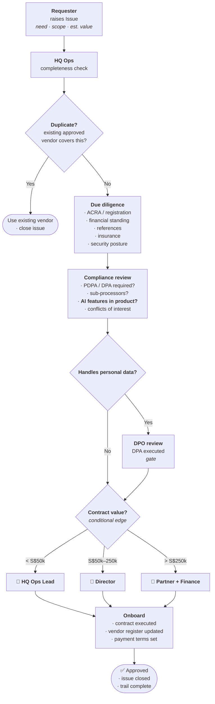
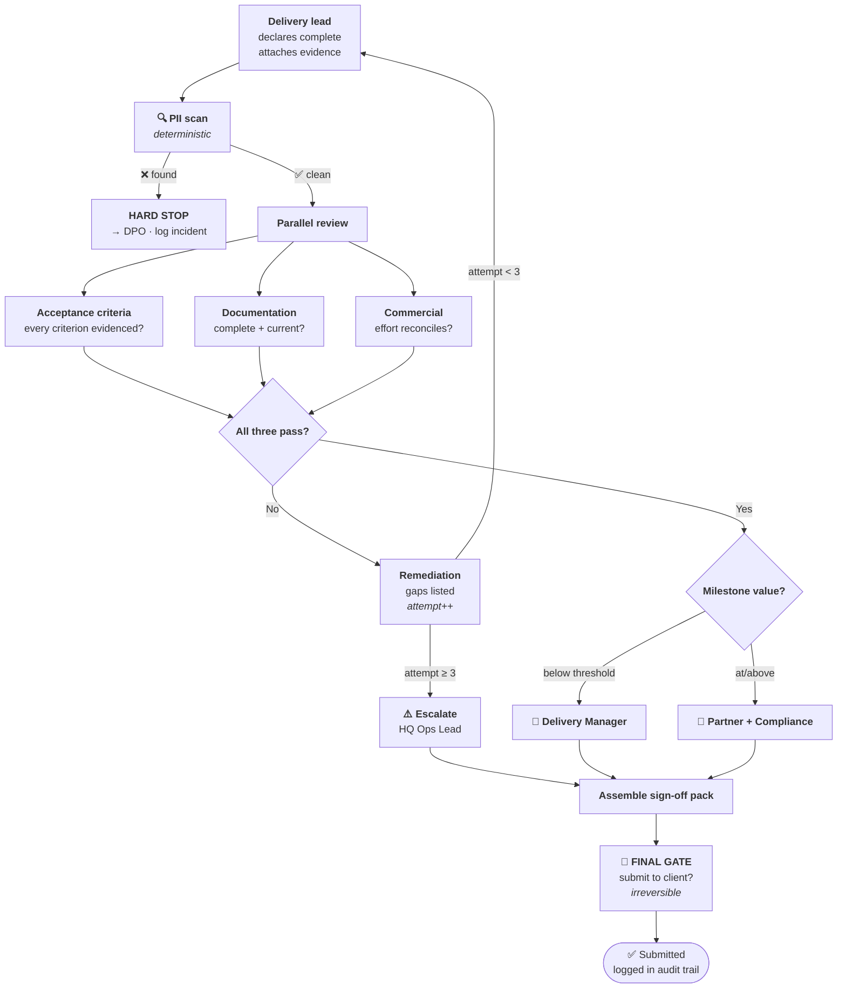
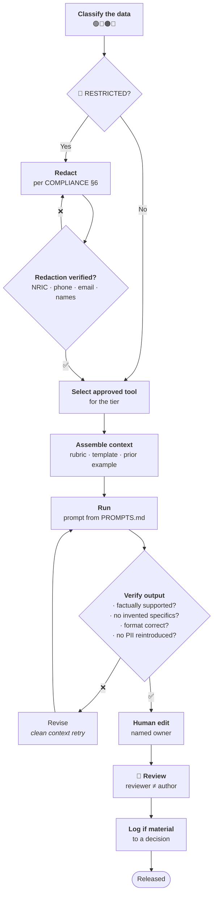

# WORKFLOW.md — Standard Operating Procedures

> ## ⚠️ TEACHING DOCUMENT
> Illustrative SOPs in a public teaching repository. Role names, thresholds and timelines
> are **examples**. Not CGP's operative procedures. See [disclaimer](README.md#-disclaimer).

---

## How to read this document

Every SOP below is written in **graph shape** — deliberately. Each one names:

- **State** — what travels with the job (the case file)
- **Nodes** — who does what
- **Edges** — the routing rules, including conditional ones
- **Gates** — where a human must approve *before* the next step

This is the vocabulary from [learn/04-GRAPH-ENGINEERING.md](learn/04-GRAPH-ENGINEERING.md),
and it is used here for a reason that applies whether or not anything is ever automated:
**it forces the implicit process to become explicit.** A process written this way can be
audited, delegated and improved. One that lives in three people's heads cannot.

---

## The universal rules

Applying to every workflow here:

1. **A named human owns every output.** Not a team, a person.
2. **Approve before, not after.** Every gate on an irreversible step is
   `interrupt_before` — see [why](learn/04-GRAPH-ENGINEERING.md#5-human-in-the-loop-as-a-first-class-citizen).
3. **The approver is never the author.** Independent verification, always.
4. **Value determines the approver.** Higher value, higher authority.
5. **Redaction precedes AI.** No exceptions. [COMPLIANCE.md](compliance/COMPLIANCE.md).
6. **The trail is the by-product.** Use PRs and issues; the audit trail writes itself.

> **Why gates are not bureaucracy:** a verified human checkpoint **resets accumulated
> failure risk**. In a chain where each step is 95% reliable, ten steps compound down to
> **59.9%** — a checkpoint restarts the decay from a known-good state. Gates are
> arithmetic. See [the data](learn/06-EVIDENCE-PACK.md#a-the-reliability-mathematics).

---

## SOP-01 · Vendor / subcontractor approval

**Trigger:** need identified for an external supplier or subcontractor.

**State:** vendor name · scope · estimated value · DD outcomes · compliance status ·
approvals with names and dates.

**Target:** 10 working days standard; 3 for expedited (requires Director approval to
expedite).

**AI may assist with:** summarising vendor documentation, drafting the DD summary,
comparing terms against our standard.
**AI must not:** make the approval decision, or replace reference checks.

---

## SOP-02 · Milestone sign-off

**Trigger:** delivery team declares a milestone complete.

This is the process modelled as a full graph in
[learn/04-GRAPH-ENGINEERING.md §8](learn/04-GRAPH-ENGINEERING.md#8-worked-example-the-imda-milestone-sign-off-graph)
— read that alongside this.

**Note the three design choices worth copying:**

- **PII scan is first and is a hard stop.** A compliance control must be impossible to
  route around, not merely discouraged. It is also a ⭐⭐⭐⭐⭐ mechanical check — a fact, not
  an opinion.
- **Three reviews run in parallel.** They are genuinely independent; running them
  sequentially only ever reflected human scheduling.
- **The circuit breaker at 3 attempts.** Prevents the death-spiral loop. A third failure
  means something is wrong that another attempt will not fix.

**AI may assist with:** assembling the evidence pack, checking deliverables against the
criteria list, drafting the summary.
**AI must not:** sign off, or decide that a criterion is "substantially met."

---

## SOP-03 · Deliverable handover

**Trigger:** approved deliverable ready for client transmission.

| # | Step | Owner | Gate |
|---|------|-------|------|
| 1 | Confirm SOP-02 sign-off complete | Delivery lead | — |
| 2 | **PII / confidentiality scan** on final artefacts | Delivery lead | 🚫 Hard stop on finding |
| 3 | Verify format against client spec | Delivery lead | — |
| 4 | Package: deliverable + evidence + version manifest | Delivery lead | — |
| 5 | **Compliance review** | Compliance Reviewer | 🚪 |
| 6 | **Final approval to transmit** | Partner / Director | 🚪 `interrupt_before` |
| 7 | Transmit via agreed channel | HQ Ops | — |
| 8 | Log: what, when, to whom, by whom, version hash | HQ Ops | — |
| 9 | Confirm receipt | HQ Ops | — |
| 10 | Archive per retention schedule | HQ Ops | — |

**Step 6 is the last reversible moment.** Once transmitted it cannot be recalled. This is
the canonical `interrupt_before` case: everything upstream can be redone; this cannot.

**Never transmit:** unversioned files · documents with tracked changes or comments
remaining · anything failing step 2 · anything without step 6 recorded.

---

## SOP-04 · AI-assisted document production

**Trigger:** any AI use on a document that will leave the team.

**The retry detail matters.** Step H says *clean context retry* — reset the window, keep
the task and a short note of what failed. Retrying inside the polluted context raises the
per-step error rate by **7.1×**
([source](learn/06-EVIDENCE-PACK.md#b-agent-failure-and-reliability-in-production)). This
is the most commonly-made mistake in day-to-day AI use, and it feels like the obvious thing
to do.

**Verification is mandatory, not optional.** AI output is a **draft with a confident
tone**. The confident tone is not evidence of correctness — it is a property of the
technology.

---

## SOP-05 · Changing an SOP

The meta-process. How this repository changes.

| # | Step | Owner |
|---|------|-------|
| 1 | Raise an Issue: what is wrong, what should change, why | Anyone |
| 2 | Discuss in the issue thread | Team |
| 3 | Create a branch; edit the file | Proposer |
| 4 | Open a **Pull Request** referencing the issue | Proposer |
| 5 | **Review** — process owner + compliance if governance-affecting | Reviewers 🚪 |
| 6 | Merge | Process owner |
| 7 | Update [CHANGELOG.md](CHANGELOG.md) | Process owner |
| 8 | Notify affected team | Process owner |

**This is the `interrupt_before` gate on your own operating procedures.** Nothing becomes
official without a named human approving a visible diff. The PR history *is* the change
control record — no separate register to maintain, and none to forget to maintain.

**Cadence:** ad-hoc as needed · quarterly review of all SOPs · annual full review with
Legal/DPO.

---

## Escalation

| Situation | Escalate to | Timeline |
|-----------|-------------|----------|
| Blocked > 2 days | Process owner | Immediate |
| Loop/automation failed 3× | HQ Ops Lead | Same day |
| Suspected data incident | **DPO** | **Within 24 hrs** |
| PII in a repo or AI tool | **DPO + IT** | **Immediate** |
| Client dispute on a deliverable | Director | Same day |
| Regulatory query | **Legal + DPO** | **Immediate — do not respond directly** |

That last row deserves emphasis: **do not answer a regulator directly.** Acknowledge
receipt, route to Legal and the DPO.

---

**Related:** [COMPLIANCE.md](compliance/COMPLIANCE.md) ·
[playbooks/](playbooks/) · [CHANGELOG.md](CHANGELOG.md) ·
[Graph engineering](learn/04-GRAPH-ENGINEERING.md)
