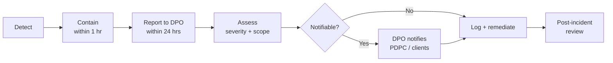

# Data Governance

> ## ⚠️ TEACHING DOCUMENT
> Illustrative template in a public teaching repository. Not an operative policy, not legal
> advice. Retention periods, role names and thresholds are **examples** requiring Legal/DPO
> review. See [COMPLIANCE.md](COMPLIANCE.md).

---

## 1. Purpose

[COMPLIANCE.md](COMPLIANCE.md) says *what you may not do*. This document covers the
plumbing: where data lives, how long it stays, who may see it, and how we prove it.

---

## 2. The systems map

Knowing which system holds what is the foundation of everything else.

| System | Holds | Max tier | Owner |
|--------|-------|----------|-------|
| **ATS** | Candidate records, CVs, contact details | 🔴 RESTRICTED | Recruitment Ops |
| **CRM** | Client contacts, pipeline, commercial terms | 🟠 CONFIDENTIAL | BD |
| **Shared drive** | Working documents, bid material | 🟠 CONFIDENTIAL | HQ Ops |
| **This repo (public)** | Training material, SOP templates | 🟢 PUBLIC | HQ Ops |
| **Internal ops repo (private)** | Live SOPs, prompt library, trackers | 🔵 INTERNAL | HQ Ops |
| **Approved AI tool** | Transient prompts/outputs | 🟠 CONFIDENTIAL | IT |

### The golden rule

> **Systems of record hold personal data. Repositories hold documents about the work.**

A repo is for SOPs, templates, rubrics, prompt libraries and trackers-by-reference. It is
never the place for CVs, contact details or identifiers. When a tracker needs to reference
a person, it references an **ATS ID** — never a name plus identifier.

```
✅  CAND-2024-0173 · Advanced to interview 2 · 14 Mar
🚫  Tan Wei Ming (S8412345C, +65 9123 4567) · Advanced
```

---

## 3. Retention

> 📝 Example periods only. Legal to confirm against PDPA, contractual and client
> requirements.

| Data | Retention | Then |
|------|-----------|------|
| Unsuccessful candidate records | _[e.g. 12 months from last contact]_ | Delete or anonymise |
| Placed candidate records | _[Term + statutory period]_ | Archive |
| Client commercial terms | _[Contract + 7 years]_ | Archive |
| Bid/tender submissions | _[7 years]_ | Archive |
| AI prompt/output logs | _[24 months]_ | Delete |
| Audit logs | _[7 years]_ | Retain |
| Training material (this repo) | Indefinite | — |

**The PDPA principle:** personal data must not be retained once the purpose has been
served and there is no legal or business need. "We might need it someday" is not a purpose.
Retention requires an affirmative reason, not merely the absence of a reason to delete.

---

## 4. Access control

Least privilege: access follows the task, not the seniority.

| Tier | Who | Mechanism |
|------|-----|-----------|
| 🟢 PUBLIC | Anyone | Public repo |
| 🔵 INTERNAL | All staff | Private repo, org membership |
| 🟠 CONFIDENTIAL | Named team + leads | Private repo, team permissions |
| 🔴 RESTRICTED | Role-based, minimum necessary | ATS controls, MFA, logged |

### Reviews

- **Quarterly:** review who has access to CONFIDENTIAL and RESTRICTED.
- **On departure:** revoke same day. Include repos, AI tools and shared drives — these are
  routinely missed because they sit outside the standard IT offboarding list.
- **On role change:** re-baseline rather than accumulate. Access creep is the normal
  failure mode of long-tenured staff.

---

## 5. Repository rules

### Public vs private

| | Public repo | Private repo |
|---|---|---|
| Training material, generic SOP templates | ✅ | ✅ |
| Live SOPs with internal detail | 🚫 | ✅ |
| Client names, project specifics | 🚫 | ✅ |
| Pricing, rate cards, bid strategy | 🚫 | ✅ (restricted) |
| Any personal data | 🚫 | 🚫 |

### Git never forgets

**The single most important technical fact on this page:**

> Deleting a file in a later commit does **not** remove it from history. Anyone who can
> read the repo can read every version of every file ever committed.

If personal data or a credential is committed, deleting it in the next commit **does not
fix it**. It remains in history, and on a public repo it must be assumed already scraped
and cached.

**If it happens:**

1. **Report immediately** — DPO and IT, same day.
2. **Assume it is compromised.** For a public repo this is not pessimism; it is realism.
3. **Rotate** any exposed credential at once.
4. IT to purge history (`git filter-repo` or GitHub support) — but treat this as damage
   limitation, not remediation.
5. Assess breach-notification obligations. **That is a DPO decision, not yours.**

**Prevention beats cure by an enormous margin:**

- A `.gitignore` covering `*.pdf`, `*.docx`, `*.xlsx`, `cv/`, `candidates/`
- Never commit a raw document received from a candidate or client
- **Review your own PR diff before requesting review** — read what you are about to publish
- Enable **secret scanning** and **push protection** on all org repos

---

## 6. AI-specific data governance

### Before a tool is approved

- [ ] Enterprise agreement in place, not a consumer account
- [ ] **Contractual guarantee that our data is not used for training**
- [ ] Processing/storage location documented; cross-border transfer assessed
- [ ] Retention and deletion terms documented
- [ ] Audit logging available
- [ ] Vendor security posture reviewed
- [ ] Client/IMDA contractual requirements checked for AI-specific clauses
- [ ] DPO sign-off recorded

### Logging AI use

Log where AI **materially contributed to a decision or a deliverable**. Do not log routine
drafting — logging everything produces a log nobody reads, which is worse than no log at
all because it looks like control.

| Field | Example |
|-------|---------|
| Date | 2026-03-14 |
| User | _[name]_ |
| Tool | _[approved tool]_ |
| Purpose | Screening summary, CAND-2024-0173 |
| Data tier | 🔵 INTERNAL (redacted from RESTRICTED) |
| Human reviewer | _[name]_ |
| Output used in | Interview shortlist, PROJ-2026-01 |

See [projects-imda/audit-logs.md](../projects-imda/audit-logs.md).

### Training and fine-tuning

> **Default position: we do not train or fine-tune models on candidate or client data.**

Per the PDPC's July 2026 guidelines, generic privacy-notice language does **not** provide
valid consent for AI model development — that requires an **AI-Specific Notification**.
Existing candidate consents almost certainly do not cover it.

Any proposal to do so — internal or vendor — goes to the **DPO before any technical work
begins**, not after a pilot has been built.

---

## 7. Third parties and vendors

Where a vendor processes personal data on our behalf, we remain accountable.

- [ ] Data processing agreement in place
- [ ] Sub-processors disclosed (including **their** AI vendors)
- [ ] Security requirements flowed down contractually
- [ ] Breach notification obligations, with timelines
- [ ] Deletion on termination
- [ ] Right to audit
- [ ] **Explicit position on AI use** — many vendors have quietly added AI features to
      existing products, and the existing DPA may predate them

That last point is the current live risk across the industry: a tool approved in 2023 may
have shipped an AI feature in 2026 under the same contract. **Re-check existing vendors,
not just new ones.**

---

## 8. Incident response



**Severity:**

| Level | Example | Response |
|-------|---------|----------|
| **Low** | Internal doc to wrong internal person | Log, correct |
| **Medium** | Confidential data in unapproved tool | Contain, DPO, review |
| **High** | Personal data exposed externally; NRIC in public repo | Immediate escalation, DPO leads |
| **Critical** | Large-scale exposure; client/IMDA data breach | Executive + DPO + Legal; regulator assessment |

**Notification obligations and timelines are a DPO/Legal determination.** Do not assess
them yourself, and do not delay reporting while you try to work out whether it "counts."

---

## 9. Quarterly checklist

- [ ] Access review (CONFIDENTIAL + RESTRICTED)
- [ ] Approved tool list still accurate; no shadow tools in use
- [ ] Retention schedule executed; overdue data deleted
- [ ] Audit log reviewed for completeness
- [ ] Repos scanned for accidental personal data
- [ ] Secret scanning / push protection confirmed enabled
- [ ] Vendor list re-checked for **newly added AI features**
- [ ] Incidents reviewed for patterns
- [ ] This document reviewed against current guidance

---

**Related:** [COMPLIANCE.md](COMPLIANCE.md) · [WORKFLOW.md](../WORKFLOW.md) ·
[audit-logs.md](../projects-imda/audit-logs.md)
