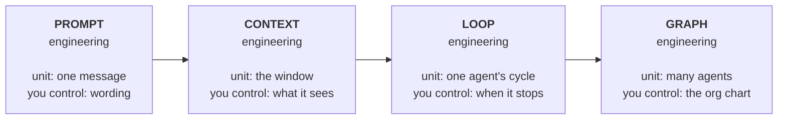

# 00 — Start Here

> **This is a teaching repository.** Nothing in it is a live operational system. All
> project data, candidate records, client names and IMDA milestones are **fictional
> examples** written to demonstrate a way of working. See [the disclaimer](../README.md#-disclaimer).

---

## Who this is for

You work at CGP. You are a recruitment consultant, a business developer, or you sit in
the HQ layer of the outsourcing team. You are **operations-heavy**: your day is made of
CVs, tender documents, status reports, approval chains, and email.

You are not a software engineer, and this track does not try to make you one.

## The one idea

Most people at most companies use AI the same way: they open a chat window, type a
request, read the answer, copy it into a document, and close the tab.

That works. It is also the **weakest possible version** of the tool, for one reason:

> **Nothing you learned survives the conversation.**

The good prompt you wrote on Tuesday is gone by Thursday. Your colleague solves the same
problem from scratch next week. Nobody can check what the AI was told before it produced
the report that went to a client. There is no version history, no review step, no
institutional memory — just 40 people privately re-deriving the same tricks.

The fix is not a better prompt. The fix is to **put the work somewhere durable, versioned
and reviewable** — which is what a Git repository is for — and then to build repeatable
*systems* on top of it instead of one-off conversations.

That progression has a name now, and it has four rungs.

---

## The four rungs

| Rung | The unit you design | The question it answers | What breaks |
|------|--------------------|--------------------------|-------------|
| **1. Prompt** | A single message | "What do I say to get a good answer?" | Vague wording, no examples |
| **2. Context** | Everything the model can see | "What should it know before it answers?" | Too much junk, or missing the key file |
| **3. Loop** | One agent's act→check→repeat cycle | "How does it keep going without me, and when does it stop?" | It never stops, or it stops while lying |
| **4. Graph** | Many agents and the paths between them | "Who does what, in what order, with which approvals?" | Errors compound; nobody can audit it |

These are **not** competing fashions where the new one replaces the old. They stack. A
graph is made of loops; a loop is made of prompts running against a context. Getting good
at rung 3 does not let you skip rung 1 — a bad prompt inside an automated loop is just a
bad prompt that now runs 200 times without supervision.

> The single most important sentence in this whole repo:
>
> **A loop with no verifier is not automation. It is an unsupervised intern with your
> client's letterhead.**

---

## The reading order

| # | File | Time | What you get |
|---|------|------|--------------|
| 00 | **You are here** | 5 min | Why this exists |
| 01 | [Prompt engineering](01-PROMPT-ENGINEERING.md) | 20 min | The floor. Do not skip. |
| 02 | [Context engineering](02-CONTEXT-ENGINEERING.md) | 20 min | Where most real gains actually come from |
| 03 | [**Loop engineering**](03-LOOP-ENGINEERING.md) | 45 min | The deep dive. The 2026 shift. |
| 04 | [**Graph engineering**](04-GRAPH-ENGINEERING.md) | 45 min | Multi-agent org design |
| 05 | [The stack compared](05-THE-STACK-COMPARED.md) | 15 min | Decision tables — when to use which |
| 06 | [Evidence pack](06-EVIDENCE-PACK.md) | — | **Every statistic, sourced. Use this to present.** |
| 07 | [GitHub for non-coders](07-GITHUB-FOR-NON-CODERS.md) | 30 min | Repos, issues, PRs — in ops language |
| 08 | [**Using agents**](08-USING-AGENTS.md) | 25 min | When AI can *act*: goal, fence, proof, stop |

If you have **one hour total**, read 02, then 03, then 06.

If you are **presenting this to leadership**, work from 06 and 05.

---

## An honest expectation-setter

Before anyone builds a business case on this, two numbers from the same body of research,
both of which belong on the same slide:

- Among knowledge workers who use AI at work, **66%** say it lets them spend more time on
  high-value work, and **75%** now use AI tools at work at all
  ([Microsoft Work Trend Index 2026, n=20,000](https://www.makerstations.io/ai-adoption-at-work-statistics/)).
- And yet a study of **6,000 executives found 89% of firms saw zero measurable
  productivity impact**
  ([analysis](https://blog.saner.ai/ai-productivity-statistics/)).

Both are true at once. Individuals get faster; organisations mostly do not. The gap
between those two numbers *is the subject of this repository*. Task-level speed does not
become firm-level output on its own — it becomes firm-level output when the improvements
are **written down, versioned, reviewed and re-run**, which is precisely what rungs 2–4
plus Git are for.

If you take away nothing else: the tool is not the differentiator. Everyone has the same
models. **The system you build around the model is the differentiator.**

---

## Ground rules before you touch any AI tool with CGP data

Non-negotiable, and they come before any of the fun stuff:

1. **No NRICs. No FINs. No passport numbers.** Ever, in any tool, in any prompt.
2. **No candidate contact details** — phone, personal email, home address.
3. **Nothing client-confidential** into a consumer AI account.
4. Anonymise **before** the prompt, not after the output.

The full rules, the legal basis, and the redaction procedure are in
[compliance/COMPLIANCE.md](../compliance/COMPLIANCE.md). Read it before your first real
prompt, not after your first incident.

---

Next → [01 — Prompt Engineering](01-PROMPT-ENGINEERING.md)
