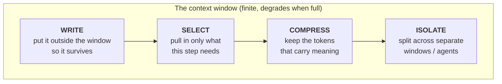

# 02 — Context Engineering

> Teaching repository. All examples use fictional data. See [disclaimer](../README.md#-disclaimer).

**Rung 2 of 4.** Unit of design: *everything the model can see.*

---

## The shift

Prompt engineering asks: **what do I say?**

Context engineering asks: **what should it be able to see when I say it?**

The formal definition in circulation is worth memorising, because it is precise:

> Context engineering is the art and science of **filling the context window with just the
> right information at each step** of an agent's trajectory.
> — [LangChain](https://www.langchain.com/blog/context-engineering-for-agents)

The operative words are *just the right*. Not *all available*.

This is the rung where most real-world gains live, and it is the one people skip, because
it feels like admin rather than cleverness. A mediocre prompt with excellent context
beats a beautiful prompt with no context, every single time.

---

## The counter-intuitive part: more context makes it worse

Everyone's instinct on getting a bad answer is to paste in more material. Context windows
are enormous now, so why not use them?

Because model performance **degrades as the window fills**. The failure mode is documented
and has a name: **context rot**.

> As tokens accumulate from prior exchanges, tool outputs and intermediate reasoning, the
> model's ability to attend to relevant information diminishes, producing increasingly
> unreliable outputs.
> — [Latitude, on agent failure modes](https://latitude.so/blog/ai-agent-failure-detection-guide)

Three distinct things go wrong as you overfill:

| Failure | What happens | Ops-world version |
|---------|--------------|--------------------|
| **Distraction** | Irrelevant material pulls the answer off-target | 60 pages of tender boilerplate bury the 3 evaluation criteria |
| **Clashing** | Two documents contradict; the model silently picks one | v3 and v7 of the pricing sheet are both in the folder |
| **Poisoning** | An early error is treated as established fact forever after | Turn 2 misreads the deadline; turns 3–40 build on it |

> **The skill is curation, not accumulation.**

That sentence is the whole rung. If you stop reading here, you have got the main idea.

---

## The four moves: Write, Select, Compress, Isolate

The standard framework, and it maps cleanly onto things an operations team already does.

### 1. WRITE — store context outside the window

Save state to a file so it survives the conversation: notes, decisions, a running plan, a
progress log.

**Ops translation:** the meeting minutes, not the meeting. A `project-notes.md` in the
repo that every session reads at the start and appends to at the end. This is the single
mechanism that turns 40 private chat histories into one institutional memory — and it is
just a text file in Git.

### 2. SELECT — pull in only what this step needs

Fetch the relevant document at the relevant moment, rather than front-loading everything.

**Ops translation:** don't attach the full 200-page tender to every question. Attach §4
Evaluation Criteria when scoring against evaluation criteria. Well-organised folders are
context engineering; that is why [INDEX.md](../INDEX.md) exists in this repo.

### 3. COMPRESS — keep only the tokens that carry the meaning

Summarise finished work before moving on. Replace a 40-turn history with a 10-line
synopsis of what was decided.

**Ops translation:** the handover note. When a long thread gets muddled, don't keep
patching it — ask for a structured summary, open a fresh session, paste the summary in.
Practitioners call this *context compaction*, and it is usually faster than fighting a
polluted thread.

### 4. ISOLATE — split the work across separate windows

Give each sub-task its own clean context. One agent reads CVs; a different one drafts the
client note. Neither carries the other's clutter.

**Ops translation:** specialists, not generalists. This move is the bridge to rung 4 —
isolation *is* what makes multi-agent graphs work, and the reason is mechanical rather
than magical: a sub-agent can burn 50,000 tokens of messy intermediate reasoning and
return a clean 200-token answer, and the caller's window only ever sees the 200.

---

## What "good context" looks like for CGP work

| Task | Bad context | Good context |
|------|-------------|--------------|
| Screen a CV | The CV alone | Anonymised CV + role brief + scoring rubric + one worked example |
| Draft a tender response | "Write an RFP response for infocomm services" | The RFP's evaluation criteria + our 3 best past responses + the win themes + the page limit |
| Weekly status report | "Summarise the project" | The milestone tracker + last week's report + this week's closed issues + the reporting template |
| Summarise a policy doc | The 80-page PDF | The 6 pages that changed + last version's summary + "what changed?" as the question |

Notice the pattern in the right-hand column: **the rubric, the template, the prior
example, the delta.** Three of those four are files that ought to live in a repo. That is
the connection between "learn AI" and "learn GitHub" — they are the same project. The
repo is not where you store the AI work; the repo *is* the context.

---

## The context checklist

Before any prompt that matters, five questions:

- [ ] **Instructions** — is the role and task stated?
- [ ] **Knowledge** — does it have the source material? (Or will it invent it?)
- [ ] **Standard** — does it have the rubric/template/example to match?
- [ ] **Memory** — does it know what was decided previously?
- [ ] **Hygiene** — have I removed contradictions, stale versions and PII?

That last box is a compliance control, not a quality one. Anonymise *before* the prompt.
See [compliance/COMPLIANCE.md](../compliance/COMPLIANCE.md).

---

## Where context engineering stops

You have curated perfect context. You still have to sit there and drive: run the step,
read the output, decide the next step, run it, paste, repeat. For a 30-step job you are
the bottleneck, and you are doing the least interesting part — being the thing that
presses enter.

That is what rung 3 removes.

---

Next → [03 — Loop Engineering](03-LOOP-ENGINEERING.md)
