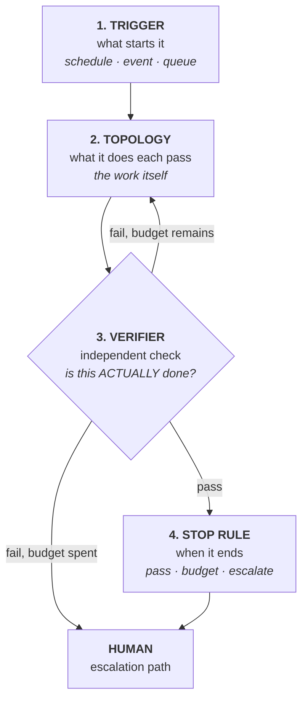
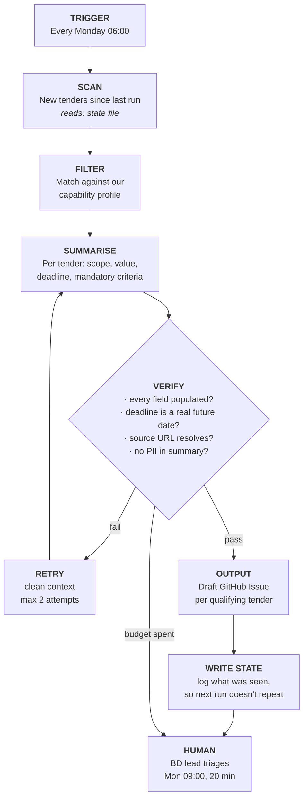

# 03 — Loop Engineering (Deep Dive)

> Teaching repository. All examples use fictional data. See [disclaimer](../README.md#-disclaimer).

**Rung 3 of 4.** Unit of design: *one agent's act → observe → verify → repeat cycle.*

---

## Contents

1. [Where the term came from](#1-where-the-term-came-from)
2. [The definition](#2-the-definition)
3. [Anatomy of a loop: the four parts](#3-anatomy-of-a-loop-the-four-parts)
4. [Osmani's six components](#4-osmanis-six-components)
5. [The verifier problem — the hard part](#5-the-verifier-problem--the-hard-part)
6. [The arithmetic of loops (the data)](#6-the-arithmetic-of-loops-the-data)
7. [The six failure modes](#7-the-six-failure-modes)
8. [Worked example: the Monday morning tender loop](#8-worked-example-the-monday-morning-tender-loop)
9. [The loop maturity ladder](#9-the-loop-maturity-ladder)
10. [How to build your first loop](#10-how-to-build-your-first-loop)
11. [What to measure](#11-what-to-measure)
12. [When not to build a loop](#12-when-not-to-build-a-loop)

---

## 1. Where the term came from

Loop engineering is genuinely new terminology — it was coined in **June 2026**, which is
why it will not appear in training material written before then.

The origin is two pieces of writing landing in the same fortnight:

- **Peter Steinberger** wrote that developers *"shouldn't be prompting coding agents
  anymore"* and should instead be *"designing loops that prompt your agents."* This is the
  viral one-liner that named the shift.
- **Addy Osmani** then published the essay [*Loop
  Engineering*](https://addyosmani.com/blog/loop-engineering/), which gave the practice its
  anatomy. It was picked up by [O'Reilly Radar](https://www.oreilly.com/radar/loop-engineering/).

Osmani's framing of *why* the shift happened is the part that matters for an operations
team, and it is not about capability — it is about supervision economics:

> Prompt-by-prompt supervision stopped scaling with review capacity.

Read that again, because it is the business case in one line. The bottleneck was never
that the AI couldn't do more. The bottleneck is that **a human has to look at everything
it does**, and there are only so many hours. Loop engineering is the discipline of
building a system that does the routine checking, so the human's scarce attention gets
spent on the exceptions.

For an HQ operations layer that spends its week checking other people's work, that is not
a technical curiosity. That is the job description.

---

## 2. The definition

> **Loop engineering is the practice of designing the control system that prompts,
> verifies, retries and stops an AI agent — instead of prompting that agent yourself,
> turn by turn.**

Compare the two questions:

| | The question you ask |
|---|---|
| **Prompt engineering** | "What should I say to get the best output?" |
| **Loop engineering** | "What system should I build so the agent finds the work, does it, verifies it, and remembers what it did — **without me in the loop at all**?" |

The role change is the point:

> Loop engineering swaps you out as *"the person who hits enter"* and turns you into
> *"the person who designs the loop."*

A useful compact formulation: **a loop is a prompt repeated with scaffolding around it.**
It is complementary to prompt engineering, not a replacement for it. The scaffolding is
the new part, and the scaffolding is where all the difficulty lives.

---

## 3. Anatomy of a loop: the four parts

An agentic loop becomes *trustworthy* when four things combine. Miss any one and you have
a liability rather than an asset.

### 1. Trigger — what starts the loop

A schedule (every weekday 07:00), an event (a new RFP lands in the folder), or a queue
(unprocessed CVs). Without a trigger you do not have a loop; you have a script you still
have to remember to run. Osmani is explicit that scheduled **automations** are *"what makes
it a real loop."*

### 2. Topology — what happens on each pass

The actual work: read the input, do the task, produce the output. This is your prompt and
context work from rungs 1 and 2, unchanged. Everything you learned still applies.

### 3. Verifier — the independent check

The part everyone skips. **Something other than the doer must decide whether the work is
actually done.** More on this below, because it is the crux.

### 4. Stop rule — the boundary

Explicit conditions for ending:

- **Success:** the verifier passes.
- **Budget:** max iterations, max tokens, max wall-clock time.
- **Escalation:** stuck, ambiguous, or high-stakes → hand to a human.

A loop without a budget can run until it hits a rate limit, burning money the entire time.
A loop without an escalation path silently produces bad work when it meets something it
does not understand. **You need all three.**

---

## 4. Osmani's six components

The essay's anatomy of a production loop. Translated out of developer vocabulary:

| # | Component | Developer meaning | **Ops-world meaning** |
|---|-----------|-------------------|------------------------|
| 1 | **Automations** | Scheduled runs | The recurring calendar slot — *"every Monday 07:00, before anyone's in"* |
| 2 | **Worktrees** | Isolated parallel copies | Separate desks. Draft 3 tender responses at once, none touching each other's files |
| 3 | **Skills** | Codified knowledge (`SKILL.md`) | The SOP written down once, loaded by every run — *this is your playbooks folder* |
| 4 | **Connectors** | MCP integrations to real tools | The AI can actually read the shared drive and update the tracker, not just talk about it |
| 5 | **Sub-agents** | Independent verification | The second pair of eyes — *a different reviewer from the drafter* |
| 6 | **External state** | Markdown files or a board | The running log, so tomorrow's run knows what yesterday's did |

**Component 6 is the one to fight for.** Without external state, every run starts from
amnesia and re-does yesterday's work. With it, the loop accumulates. Osmani's own worked
example ends on exactly this note:

> The state file remembers what got tried, what passed, and what is still open, so
> tomorrow morning the run picks up where today stopped.

Notice how many of these six are just **files in a repository**. Skills are markdown.
External state is markdown. That is why this repo teaches Git and AI as one subject rather
than two: the repository is the loop's memory and its rulebook.

---

## 5. The verifier problem — the hard part

If you take one section from this page, take this one.

> Agents tend to aim for **"looks done"** unless a verifier and stop rules gate every
> iteration.

An agent asked to produce a tender response will produce something shaped exactly like a
tender response. Right length, right headings, confident tone. Whether the pricing table
reconciles, whether the certifications cited are ones we actually hold, whether it answers
the question asked — those are different properties, and nothing in "generate a document"
optimises for them.

The structural fix is to **separate the maker from the checker**:

> The whole reason you split the verifier sub-agent from the maker is to make the loop's
> "it's done" mean something — and even then, **"done" is a claim and not a proof.**

That final clause deserves to be on a slide. A verifier reduces your error rate; it does
not eliminate it. Which is why high-stakes outputs still need a human gate — see
[rung 4](04-GRAPH-ENGINEERING.md).

### The verifier strength ladder

Not all verifiers are equal. Ranked weakest to strongest:

| Strength | Verifier type | Example | Trust |
|----------|---------------|---------|-------|
| ⭐ | **Self-check** — same agent reviews its own work | "Now check your answer" | Very low. It already thinks it's right. |
| ⭐⭐ | **Second agent, same prompt** | Fresh agent, "is this good?" | Low. Correlated blind spots. |
| ⭐⭐⭐ | **Second agent, adversarial prompt** | *"Find three things wrong with this."* | Moderate. Framing does real work. |
| ⭐⭐⭐⭐ | **Rubric-based** | Score against a fixed written checklist | Good. Reproducible and auditable. |
| ⭐⭐⭐⭐⭐ | **Deterministic / mechanical** | Does the pricing table sum correctly? Is every mandatory RFP section present? | **Highest. Not an opinion — a fact.** |

**Design principle: push verification as far down this table as you can.** Every check you
can turn into an objective test is a check you no longer have to trust a model to perform.

For CGP work, plenty of the important checks are mechanical and nobody is using them:

- Does the response include all mandatory RFP sections? → *checklist match*
- Do the quoted rates match the approved rate card? → *lookup*
- Does the CV summary contain any 7-digit-plus number, or an `S/T/F/G` + 7 digits + letter
  pattern? → **PII leak detector, and it should hard-fail the loop**
- Is every named certification on our verified list? → *lookup*

That last-but-one is worth building on day one regardless of anything else on this page.

---

## 6. The arithmetic of loops (the data)

This section is your presentation material. It is the part that converts "AI is exciting"
into "here is the engineering constraint we must design around."

### 6.1 Reliability compounds downward

If each step succeeds with probability `p`, an `N`-step run succeeds with probability
`p^N`. This is unforgiving, and it is the single most important number in agentic systems.

| Per-step accuracy | 3 steps | 5 steps | 10 steps | 100 steps |
|-------------------|---------|---------|----------|-----------|
| **70%** | 34% | 17% | 2.8% | ~0% |
| **90%** | 73% | 59% | 35% | ~0% |
| **95%** | 86% | 77% | **59.9%** | 0.6% |
| **99%** | 97% | 95% | 90% | 37% |
| **99.9%** | 99.7% | 99.5% | 99% | **90.5%** |

Sourced figures behind that table:

- 95% per step, 10 steps → **59.9%** end-to-end
  ([Zartis](https://www.zartis.com/the-compounding-errors-problem-why-multi-agent-systems-fail-and-the-architecture-that-fixes-it/))
- Three agents at 95% each → **86%**; at 70% each → **34%**
  ([Kore.ai](https://www.kore.ai/blog/multi-agent-systems-fault-line))
- Chaining **five** agents drops success to **77%**
  ([MindStudio](https://www.mindstudio.ai/blog/multi-agent-reliability-compounding-problem-77-percent))
- Even **99.9%** per step yields only **90.5%** over 100 steps
  ([Corvair](https://corvair.ai/six-sigma/compound-error.html))
- A **1% per-token** error rate compounds to **87% cumulative failure by token 200**

**What this means in practice:** a 95%-accurate agent sounds excellent and is nearly
useless unsupervised over a long horizon. The reason your loop needs a verifier is not
that the model is bad. It is that **arithmetic is bad.**

The design responses that follow directly from the table:

1. **Shorten the chain.** Fewer steps beats smarter steps. 10 steps → 5 steps at 95%
   takes you from 60% to 77% with no model improvement at all.
2. **Insert checkpoints.** Verified state resets the decay — see 6.3.
3. **Make steps deterministic where possible.** A lookup is 100%, not 95%.

### 6.2 Failure makes the next attempt worse

This one is counter-intuitive and important. When an agent fails and retries, the failed
attempt **stays in the conversation history** and contaminates the next attempt.

> A **May 2026 Rutgers University study** found that failed attempts raise the per-step
> error rate by **7.1× over baseline**.
> — [via Latitude](https://latitude.so/blog/ai-agent-failure-detection-guide)

So naive retry — "just try again in the same thread" — is actively harmful. It is the
mechanism behind the *death-spiral loop*, where an agent tries the same broken approach
twenty times with increasing confusion.

**The fix:** retry with a **clean context**. Reset the window, keep only the original task
plus a short structured note on what failed and why. This is the COMPRESS move from
[rung 2](02-CONTEXT-ENGINEERING.md) doing load-bearing work.

### 6.3 Human checkpoints reset the decay

The good news, and the justification for every approval gate in
[WORKFLOW.md](../WORKFLOW.md):

> Once a human confirms an output, the accumulated failure risk **resets** — the rest of
> the chain starts fresh from a verified state.
> — [Zartis](https://www.zartis.com/the-compounding-errors-problem-why-multi-agent-systems-fail-and-the-architecture-that-fixes-it/)

A human gate is not friction slowing the automation down. It is a **mathematical reset on
compounding error.** Place them deliberately: a 20-step run with a verified checkpoint at
step 10 is two 10-step runs (60% × 60% → but each independently recoverable), not one
20-step run at 36%.

Place gates at: anything client-facing, anything contractually binding, anything
irreversible, anything touching personal data.

### 6.4 The wider reliability picture

- **Over 60% of production agent incidents trace back to state-management failures** —
  the leading category, ahead of model quality
  ([Atlan](https://atlan.com/know/ai-agent/ai-agent-memory/what-is-langgraph/)).
  Your agent is far more likely to fail from losing track of what it was doing than from
  being insufficiently clever.
- Industry analyses put agent project failure rates in production at
  **70–95%** ([Fiddler AI](https://www.fiddler.ai/blog/ai-agent-failure-rate)).
  Most of those failures are engineering-discipline failures, not model failures.

**The headline for leadership:** the constraint on agentic AI is not model intelligence.
It is **state, verification and error compounding** — all three of which are
*architecture* problems, which means they are solvable by design rather than by waiting
for a better model.

---

## 7. The six failure modes

Six failure modes are specific to agents (as opposed to plain chat). Learn to name them —
naming is most of diagnosing.

| # | Failure mode | Symptom | Mitigation |
|---|--------------|---------|------------|
| 1 | **Tool misuse** | Calls the wrong tool, or the right tool with wrong arguments | Fewer, clearer tools; validate inputs |
| 2 | **Context loss** | Forgets a constraint stated 20 turns ago | External state file; re-inject constraints each pass |
| 3 | **Goal drift** | Ends up solving an adjacent, easier problem | Restate the objective every iteration; verifier checks against the *original* goal |
| 4 | **Retry loops** | Same failing action, over and over, burning budget | Step budget + circuit breaker + clean-context retry |
| 5 | **Cascading errors** | One bad output becomes the next step's trusted input | Checkpoints; validate at handoff boundaries |
| 6 | **Silent quality degradation** | Still produces output; it is quietly getting worse | Sampled human review; track quality over time, not just completion |

**#6 is the dangerous one.** The others announce themselves — the loop crashes, or spins,
or obviously misbehaves. Silent degradation looks exactly like success on the dashboard.
It is the reason "the loop ran green all quarter" is not evidence of anything, and the
reason your loop needs **sampled human audit** even when it reports success. Budget for
reviewing a random 5–10% of passed outputs, forever.

---

## 8. Worked example: the Monday morning tender loop

Fictional, illustrative, and deliberately realistic in shape.

**The manual version (today):** every Monday, a BD manager spends three hours checking
GeBIZ and agency portals for new infocomm tenders, opening each one, deciding whether it
fits, and writing a summary for the Tuesday pipeline meeting. It is dull, it is
repetitive, and when they are on leave it does not happen.

**The loop version:**

**What changed:** the BD manager's Monday goes from *three hours of scanning* to *twenty
minutes of triage on a pre-filtered, pre-summarised list.* The human is still the decision
maker — they just stopped being the search engine.

**The four parts, named explicitly:**

- **Trigger:** Monday 06:00 schedule.
- **Topology:** scan → filter → summarise.
- **Verifier:** deterministic checks (fields populated, date is real and future, URL
  resolves, PII regex clean). Note these are ⭐⭐⭐⭐⭐ mechanical checks, not model opinions.
- **Stop rule:** verifier passes → publish; 2 failed retries → escalate; always → human
  triage before anything leaves the building.

**What is deliberately *not* automated:** the bid/no-bid decision. That is judgement,
money and relationships. The loop prepares the decision; it does not make it.

---

## 9. The loop maturity ladder

Where any given process sits. Be honest about your current rung — most teams are on 0 and
believe they are on 2.

| Level | Name | What it looks like | Human effort |
|-------|------|--------------------|--------------|
| **0** | **Manual chat** | You prompt, read, copy-paste | 100% |
| **1** | **Saved prompts** | Standard prompts in `PROMPTS.md`, still run by hand | ~80% |
| **2** | **Checklisted run** | Documented sequence + a written verification checklist | ~60% |
| **3** | **Assisted loop** | Agent runs the sequence, human verifies every output | ~30% |
| **4** | **Verified loop** | Automated verifier gates; human sees exceptions + samples | ~10% |
| **5** | **Scheduled loop** | Triggers itself, keeps external state, escalates when stuck | ~5%, exception-only |

**Do not jump to 5.** The path is 0 → 1 → 2 → 3 → 4 → 5, and the reason is that **level 2
is where you discover what your verifier needs to check.** Teams that skip to automation
build loops that verify the wrong things confidently. Write the checklist by hand, use it
manually for a fortnight, and *then* automate the checklist.

Levels 1 and 2 require **no technology at all** — they are markdown files and discipline.
That is most of the value, available this week, at zero infrastructure cost.

---

## 10. How to build your first loop

Pick a process that is **frequent, rule-based, currently annoying, and low-stakes if
wrong.** Weekly status report collation is the classic starter. Anything client-facing or
contractual is a bad first choice.

**Step 1 — Write the manual SOP.** Number the steps. If you cannot write it down, you
cannot automate it, and discovering that is itself worth the hour.

**Step 2 — Write the verification checklist *before* the automation.** What does "done
correctly" mean? List the concrete checks. Which are mechanical? Push as many as possible
down to mechanical.

**Step 3 — Run it manually for two weeks.** Use your own checklist. Note every time it
fails, and *why*. This list is your real requirements document — it is worth more than any
amount of upfront design.

**Step 4 — Automate the topology only.** Agent does the work; you verify every output by
hand. This is level 3. Stay here until quality is boring.

**Step 5 — Automate the verifier.** Encode the mechanical checks. Human now sees only
failures plus a random sample of passes. Level 4.

**Step 6 — Add trigger and state.** Schedule it. Give it a state file. Level 5.

**Step 7 — Keep the sample audit forever.** Failure mode #6 does not go away because the
loop is mature. Review a random 5–10% permanently.

---

## 11. What to measure

Do not measure "number of runs." Measure these:

| Metric | Definition | Why it matters |
|--------|------------|----------------|
| **Task success rate** | Passed verification ÷ attempted | The headline number |
| **Loop rate** | Average iterations per completed task | Rising = the loop is struggling |
| **Escalation rate** | Runs handed to a human | Should fall, then plateau. Zero is suspicious. |
| **Cost per *successful* task** | Total spend ÷ successes (not ÷ attempts) | The only honest cost figure |
| **Sampled quality score** | Human rating of a random sample | **The only detector for silent degradation** |
| **Time-to-escalation** | How fast a stuck loop reaches a person | Trapped work is invisible work |

**Cost per successful task** is the metric people get wrong. Dividing total cost by total
runs hides retries; a loop that needs four attempts costs four times what its per-run
figure suggests. Retry-heavy loops can quietly cost more than the manual process they
replaced — measure the honest number.

---

## 12. When not to build a loop

Loops are not free. They cost design time, they need maintenance, and a broken loop
produces confident wrong work at machine speed. Skip the loop when:

- ❌ **The task is rare.** Twice a year? Just do it. The loop costs more than the task.
- ❌ **The task changes every time.** Loops need a stable shape.
- ❌ **You cannot define "done."** No verifier possible → no loop. This is disqualifying.
- ❌ **The stakes are high and the run is irreversible.** Sending to a client, submitting a
  bid, anything contractual.
- ❌ **It touches personal data and you have not built redaction first.** Non-negotiable —
  see [COMPLIANCE.md](../compliance/COMPLIANCE.md).
- ❌ **You are on maturity level 0** and want to jump to 5.

> The right question is never *"can this be automated?"* It is **"can this be
> *verified*?"** If the answer is no, the loop is not a productivity tool — it is an
> unaudited liability.

---

## The one-slide summary

- Loop engineering = designing the system that **prompts, verifies, retries and stops** an
  agent, instead of doing it turn by turn yourself. Coined June 2026.
- Four parts: **trigger, topology, verifier, stop rule.** All four required.
- The verifier must be **independent of the maker**, and mechanical wherever possible.
- **Reliability compounds downward:** 95% per step over 10 steps = **59.9%** end-to-end.
- **Failed attempts make the next attempt 7.1× worse** — retry with a *clean context*.
- **Human checkpoints reset accumulated error** — gates are maths, not bureaucracy.
- **>60% of production incidents are state-management failures**, not intelligence failures.
- Climb the ladder 0→5. Levels 1–2 are free and are most of the value.

---

Next → [04 — Graph Engineering](04-GRAPH-ENGINEERING.md)
