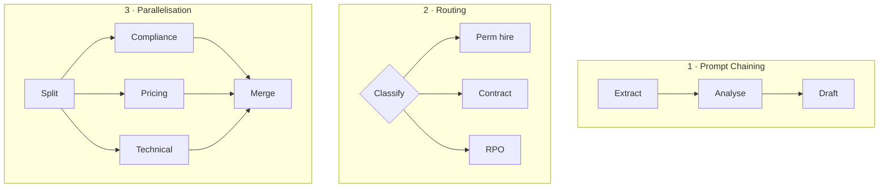
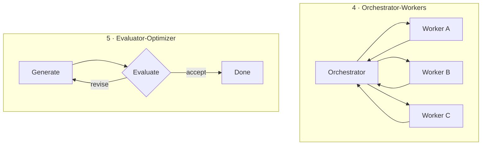
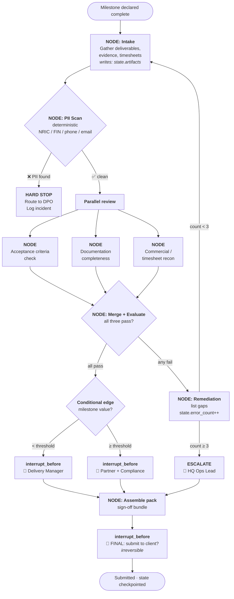

# 04 — Graph Engineering (Deep Dive)

> Teaching repository. All examples use fictional data. See [disclaimer](../README.md#-disclaimer).

**Rung 4 of 4.** Unit of design: *many agents, and the paths between them.*

---

## Contents

1. [The jump from loop to graph](#1-the-jump-from-loop-to-graph)
2. [The three primitives: state, nodes, edges](#2-the-three-primitives-state-nodes-edges)
3. [State is the whole ballgame](#3-state-is-the-whole-ballgame)
4. [Checkpointing, time travel and recovery](#4-checkpointing-time-travel-and-recovery)
5. [Human-in-the-loop as a first-class citizen](#5-human-in-the-loop-as-a-first-class-citizen)
6. [The pattern catalogue](#6-the-pattern-catalogue)
7. [Supervisor vs swarm — and what survives production](#7-supervisor-vs-swarm--and-what-survives-production)
8. [Worked example: the IMDA milestone sign-off graph](#8-worked-example-the-imda-milestone-sign-off-graph)
9. [Why an ops team should care even if they never write code](#9-why-an-ops-team-should-care-even-if-they-never-write-code)
10. [When a graph is the wrong answer](#10-when-a-graph-is-the-wrong-answer)

---

## 1. The jump from loop to graph

A loop governs **one agent doing one job**, cycling until a verifier says stop. That works
beautifully right up until reality intrudes with any of these:

- The path has to **branch** — a permanent hire and a contract placement follow different
  approval routes.
- Work must **route between specialists** — the compliance check and the pricing check are
  different skills entirely.
- A **human has to intervene mid-run** and the process must survive the wait — a partner
  approves the pricing on Tuesday, and the run must still be alive on Wednesday.
- Different steps carry **different risk**, so they need different gates.

A single loop handles none of these gracefully. What you need is a **map** of who does
what, in what order, with which conditions — and the ability to pause, resume and audit
any point on it.

The clean formulation:

> **Loops = one agent's behaviour. Graphs = the org structure connecting many agents.**

Or, from the same source, the framing that lands best with an operations audience:

> Graph engineering makes **multi-agent organisations programmable**.

You already understand graphs. An org chart is a graph. An approval workflow is a graph.
A tender process with its stage gates is a graph. **Graph engineering is drawing that
diagram precisely enough that software can execute it** — and then letting the model fill
in the boxes rather than decide the boxes.

That last distinction is the core insight of the whole rung:

> You draw the steps and the connections between them **ahead of time**, and let the model
> fill in the boxes.

In a pure loop, the agent decides what to do next — flexible, and unpredictable. In a
graph, **you** decide the possible routes in advance and the agent only decides the
content within a step. You trade some autonomy for something an operations team values far
more highly: **predictability, auditability and the ability to put a gate anywhere.**

---

## 2. The three primitives: state, nodes, edges

Graph frameworks — [LangGraph](https://www.langchain.com/blog/3-years-of-graph-engineering-with-langgraph)
is the reference implementation and the source of most published production experience —
organise everything around three things:

> **State, Nodes and Edges** — which together define what the agent knows, what it can do,
> and how it decides what to do next.

| Primitive | What it is | Ops-world equivalent |
|-----------|------------|----------------------|
| **State** | The shared record every step reads and writes | **The case file** that travels with the job |
| **Node** | One discrete unit of work | **A desk** — a person or team who does one thing |
| **Edge** | The routing rule between nodes | **The handover rule** — "if value > $500k, route to partner" |

### Nodes

Discrete operations: call a model, run a tool, validate an output, apply a rule. Each node
does one thing and returns an **update to the state**. Nodes are ideally stateless — they
receive the case file, do their piece, hand it back.

### Edges

Two kinds, and the distinction matters:

- **Direct edges** — fixed sequence. A always goes to B.
- **Conditional edges** — branching. Look at the state, decide where next.

Conditional edges are where your business rules live. "If the bid value exceeds S$500,000,
route to partner approval; otherwise route to manager approval" is a conditional edge, and
writing it down as one is a genuine improvement on having it live in three people's heads.

---

## 3. State is the whole ballgame

If you remember one fact from this page, make it this one:

> **Over 60% of production agent incidents trace back to state-management failures** —
> the leading failure category in production agent deployments.
> — [Atlan](https://atlan.com/know/ai-agent/ai-agent-memory/what-is-langgraph/)

Not model quality. Not prompt quality. **State.** The agent lost track of what it was
doing, or two steps disagreed about what had happened, or a restart lost the work.

This is why graph frameworks are built state-first:

> Every node sees the same state; every state update is checkpointed.

### The ops translation

Your state object is **the case file**. In a well-run manual process, a job travelling
between desks carries a folder containing everything decided so far. Each desk reads the
folder, does its bit, adds its output, passes it on. Nobody re-derives what was already
decided; nobody works from a stale copy.

Badly-run processes lose the folder. Someone works from an outdated version, two people
make contradictory decisions, and nobody can reconstruct who approved what.

**That is exactly the 60% figure, and it is the same failure in both worlds.** The
discipline that fixes it is the same discipline too: one authoritative record, appended to
rather than overwritten, with a history you can read back.

For a graph, a typical state for a tender response might carry:

```
tender_id            · the identifier
raw_documents        · what came in
extracted_criteria   · what the evaluation asks for
draft_sections       · what we've written so far
compliance_status    · pass / fail / pending
pricing_approved_by  · who signed, and when
error_count          · how many times we've retried
last_error           · what went wrong most recently
audit_trail          · every transition, timestamped
```

Those last three fields are not incidental. **Build retries at the state level** by adding
`error_count` and `last_error`, catching exceptions inside nodes, and routing to a retry or
fallback node via a conditional edge. That is the graph-shaped answer to the retry problem
from [rung 3](03-LOOP-ENGINEERING.md#62-failure-makes-the-next-attempt-worse) — and because
the retry is a *route* rather than a *repetition inside the same context*, it naturally
avoids the 7.1× contamination penalty.

---

## 4. Checkpointing, time travel and recovery

Graph frameworks persist the full state after **every node execution**, using
database-backed checkpointers in production (PostgreSQL, SQLite, Redis).

The consequence is the feature operations people immediately understand:

> Each checkpoint is identified by a unique ID, forming a **branching tree of execution
> states that you can navigate like Git commits**: inspect any historical state, rewind to
> it, and optionally fork a new branch from that point.

Three capabilities fall out of this, and each maps to something an audit-heavy team
already needs:

| Capability | What it means | Why HQ cares |
|------------|---------------|--------------|
| **Durability** | A crash, restart or overnight wait loses nothing | Processes can span days and human availability |
| **Time travel** | Rewind to any prior state and inspect it | *"What did the system know when it made that call?"* — the audit question |
| **Forking** | Branch from a past state and try a different route | "Re-run the pricing with the revised rate card, keep everything else" |

**This is the audit trail regulators ask for, generated as a by-product of the
architecture** rather than as a documentation chore bolted on afterwards. For work under
IMDA governance expectations — see [compliance/COMPLIANCE.md](../compliance/COMPLIANCE.md)
— that is not a nice-to-have. Being able to answer *"who or what decided this, on what
information, and when"* is the substance of accountability.

---

## 5. Human-in-the-loop as a first-class citizen

In a loop, a human interrupt is an awkward special case. In a graph it is just another
node.

> A conditional edge can route execution to an **interrupt node**, pausing the graph until
> a human approves or modifies the next step.

The process stops, persists its state, and waits — for a minute or a week. When the human
responds, it resumes exactly where it paused, with full context intact. Nothing is lost to
the wait.

### The one detail that catches everyone

> A common human-in-the-loop mistake is confusing `interrupt_after` with `interrupt_before`
> — with `interrupt_after`, **the action has already happened** before the pause.

Worth stating in plain language, because the concept generalises well beyond any one
framework:

- **`interrupt_before`** = *approve before it happens.* → "May I send this to the client?"
- **`interrupt_after`** = *review after it happened.* → "I have sent this to the client."

For anything irreversible — submitting a bid, emailing a client, publishing a report,
transmitting personal data — you want **`interrupt_before`**. Getting this backwards is
how an "approval workflow" turns out to be a notification workflow, discovered at the
worst possible moment.

Recall from [rung 3](03-LOOP-ENGINEERING.md#63-human-checkpoints-reset-the-decay) that a
human checkpoint **resets accumulated failure risk**. Combine that with the compounding
table and the placement rule becomes precise rather than vibes-based:

> **Put a human gate immediately before every irreversible or externally-visible action,
> and at any point where the chain has run long enough that `p^N` has decayed past your
> tolerance.**

---

## 6. The pattern catalogue

Five workflow patterns cover the overwhelming majority of real systems. Learn the names;
you will recognise all five from processes your team already runs manually.





| # | Pattern | Use when | CGP example |
|---|---------|----------|-------------|
| 1 | **Prompt chaining** | Fixed sequence, each step feeds the next | Parse CV → score against rubric → draft summary |
| 2 | **Routing** | Input type determines the path | Classify the enquiry: perm / contract / RPO → different playbooks |
| 3 | **Parallelisation** | Independent sub-tasks, then merge | Compliance, pricing and technical review of an RFP — simultaneously |
| 4 | **Orchestrator-workers** | A coordinator decomposes and delegates dynamically | Tender lead breaks an RFP into sections, assigns each, assembles |
| 5 | **Evaluator-optimizer** | Draft → critique → revise until it passes | Draft response → score against evaluation criteria → revise |

Pattern 5 is the **reflection** pattern, and it is [rung 3's verifier](03-LOOP-ENGINEERING.md#5-the-verifier-problem--the-hard-part)
expressed as a graph. Pattern 3 is worth flagging separately for ops teams: parallel review
is the pattern with the most obvious immediate payoff, because compliance, pricing and
technical review genuinely are independent and are usually run in sequence purely because
of human scheduling.

In an orchestrator-workers setup, the division of labour is deliberate:

> The orchestrator maintains global state, handles error recovery, and decides when the
> overall task is complete, while **workers are stateless** and focus on a single
> capability.

Stateless workers are much easier to reason about, test and replace — the same reason a
well-designed manual process gives each desk one clear responsibility.

---

## 7. Supervisor vs swarm — and what survives production

Two competing philosophies for multi-agent coordination.

### Supervisor (hierarchical)

A central coordinator routes tasks, choosing which specialist handles each sub-task based
on the current state. Supervisors can nest — a supervisor can control other supervisors.

**This is a management hierarchy**, and it behaves like one: clear accountability, one
place to look when something goes wrong, one place to instrument. Also one bottleneck.

### Swarm (peer-to-peer)

> In a swarm, all agents are on the same level, and their relationships are determined
> directly through explicitly defined **hand-off tools**.

No central coordinator; agents hand off to each other directly. More flexible, better for
genuinely independent workloads — and considerably harder to debug, because there is no
single place where "what is happening right now" is known.

### The production verdict

This is the part to put in front of anyone proposing an elaborate architecture:

> **Hierarchical (supervisor-worker) and graph topologies are the two multi-agent patterns
> that earn their cost in production**, while swarm and blackboard patterns are
> theoretically interesting but **rarely outperform hierarchical or graph in practice**.
> — [Digital Applied, 2026 taxonomy](https://www.digitalapplied.com/blog/agent-architecture-patterns-taxonomy-2026)

The practical guidance, which matches the general shape of engineering advice everywhere:

| Situation | Use |
|-----------|-----|
| One objective, one verifier, no mid-run handoff | **A plain loop** — do not build a graph |
| Branching paths, specialist routing, human gates mid-run | **A graph** |
| Clear accountability required, auditability matters | **Supervisor / hierarchical** |
| Genuinely independent parallel workloads, high tolerance for messiness | Swarm — *and be honest that you probably do not need it* |

For a compliance-heavy, audit-sensitive environment, **supervisor/hierarchical is almost
always the correct answer**. It produces exactly the artefact regulators and auditors want:
a clear chain of who decided what.

---

## 8. Worked example: the IMDA milestone sign-off graph

Fictional and illustrative — see [projects-imda/IMDA-DELIVERABLES.md](../projects-imda/IMDA-DELIVERABLES.md).
This shows how an existing manual approval process maps onto graph primitives without
changing what the process *is*.



**Read the design decisions off the diagram:**

| Element | Pattern | Why |
|---------|---------|-----|
| PII scan first, hard stop | Deterministic gate | ⭐⭐⭐⭐⭐ verifier. Compliance failure must be *impossible to route around*, not merely discouraged |
| Three checks in parallel | **Parallelisation** | Independent; running them in sequence only ever reflected human scheduling |
| `error_count` → remediation → escalate at 3 | State-level retry + **circuit breaker** | Prevents the death-spiral loop; caps the budget |
| Value-based routing to Manager vs Partner | **Conditional edge** | The delegation-of-authority matrix, written as code |
| Every approval is `interrupt_before` | Human-in-the-loop | Nothing irreversible happens before a human says yes |
| Final submission gate | `interrupt_before` | It leaves the building. Always a human. |
| Every transition checkpointed | Checkpointing | The audit trail is a by-product |

**The point of the exercise:** none of this invents a new process. It is CGP's existing
approval chain, drawn precisely. The value of graph engineering for an operations team is
mostly this — **it forces you to make the implicit process explicit**, and an explicit
process is one you can audit, improve and delegate, whether or not you ever automate a
single step of it.

---

## 9. Why an ops team should care even if they never write code

Fair challenge: nobody at HQ is going to write a LangGraph application. So why spend forty
minutes here?

**1. It is a diagnostic vocabulary for processes you already run.** "Our tender process has
no conditional edge for high-value bids — everything routes to the same approver
regardless of risk" is a sharper sentence than "our approval process feels wrong," and it
suggests its own fix.

**2. Your vendors will use this language.** When a systems integrator proposes an "agentic
workflow," you now know the questions that separate a real design from a demo:
*Where is the state stored? What happens on a crash mid-run? Is that gate `interrupt_before`
or `interrupt_after`? What is the retry budget? Show me the audit trail.* Four of those five
questions will not have been considered.

**3. It tells you what to document.** State, nodes, edges. What travels with the job, who
does what, and what the routing rules are. Every playbook in this repository is written in
that shape deliberately — see [playbooks/](../playbooks/).

**4. The 60% figure applies to human processes too.** Most operational failures are
state-management failures: the wrong version, the lost handover, the approval nobody can
find. Fixing that requires no AI whatsoever, and Git alone solves a surprising amount of it.

---

## 10. When a graph is the wrong answer

Graphs are heavier than loops. They cost design time and infrastructure, and an
over-engineered graph is worse than a well-run loop.

- ❌ **One objective, one verifier, no handoff** → a loop is correct. Do not escalate.
- ❌ **The process genuinely varies every time** → graphs need stable topology.
- ❌ **You have not yet made the manual process explicit** → you will encode the confusion.
- ❌ **Nobody can say who approves what** → fix the delegation matrix first; the graph will
  only make the ambiguity executable.
- ❌ **Reaching for a swarm because it sounds impressive** → see §7.

> **Escalate up the rungs only when the rung below genuinely fails you.** Most teams get
> most of their value from rungs 1–3 and a clearly-written playbook. Rung 4 is for when the
> path has to branch, route and survive a human in the middle.

---

## The one-slide summary

- Graph engineering makes **multi-agent organisations programmable** — you draw the steps
  and connections in advance, the model fills in the boxes.
- Three primitives: **state** (the case file), **nodes** (desks), **edges** (handover rules).
- **>60% of production agent incidents are state-management failures** — state is the
  ballgame, not model quality.
- **Checkpointing** gives durability, time travel and forking — *the audit trail is a
  by-product of the architecture.*
- **`interrupt_before` vs `interrupt_after`** — approve before, or find out after. For
  anything irreversible, always *before*.
- Five patterns: **chaining, routing, parallelisation, orchestrator-workers,
  evaluator-optimizer.**
- **Hierarchical and graph topologies earn their cost in production; swarms usually do
  not.**
- Use a loop for one objective and one verifier. Use a graph when the path must **branch,
  route, or survive a human in the middle.**

---

Next → [05 — The Stack Compared](05-THE-STACK-COMPARED.md)
