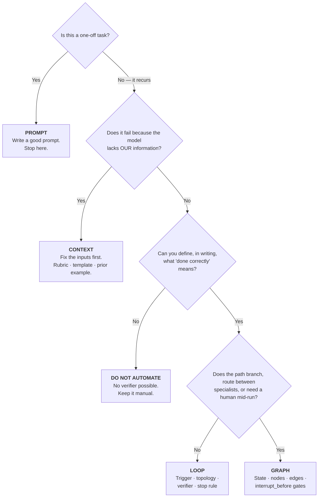

# 05 — The Stack Compared

> Teaching repository. All examples use fictional data. See [disclaimer](../README.md#-disclaimer).

Decision tables for choosing the right rung. Built for presenting.

---

## The master table

| | **Prompt** | **Context** | **Loop** | **Graph** |
|---|---|---|---|---|
| **Unit of design** | One message | The whole window | One agent's cycle | Many agents + routes |
| **The question** | What do I say? | What should it see? | How does it run and stop without me? | Who does what, in what order? |
| **You control** | Wording, format | Information supply | Iteration + stopping | Topology + gates |
| **Human role** | Author | Curator | **Loop designer** | **Process architect** |
| **Runs for** | Seconds | Seconds–minutes | Minutes–hours | Hours–days |
| **Main failure** | Vague output | Context rot | Never stops / stops while lying | Compounding error, lost state |
| **What you debug** | The wording | What was in the window | The verifier and stop rule | The routing and the state |
| **What you version** | The prompt text | The context assembly | The loop definition + checklist | The graph topology |
| **Artefact** | `PROMPTS.md` entry | Curated folder + index | SOP + verification checklist | Process diagram + state schema |
| **Cost to build** | Minutes | Hours | Days | Weeks |
| **Skill needed** | Anyone | Anyone | Ops + a little tooling | Engineering |

---

## The decision tree

**The gate at Q3 is the important one.** "Can you define done?" is the question that
should stop most automation proposals, and it stops them cheaply — before the build rather
than after.

---

## Same task, four rungs

How one real CGP-shaped job looks at each level. Note that the *work* is identical; what
changes is how much of the system is designed rather than performed.

**Task:** produce a weekly delivery status report for a client programme.

| Rung | What you do | Time/week | Who can do it |
|------|-------------|-----------|---------------|
| **Prompt** | Paste notes into chat: *"Write a status report from these notes"* | 45 min | Anyone, today |
| **Context** | Standard prompt + last week's report + the template + this week's closed issues | 25 min | Anyone, today |
| **Loop** | Scheduled Friday 16:00: pulls closed issues, drafts against template, verifies (all sections present? every RAG status justified? no PII?), you review exceptions | 5 min | Ops + light tooling |
| **Graph** | As above, plus: routes red-status items to the delivery lead for comment, parallel commercial reconciliation, `interrupt_before` on client send, full checkpointed audit trail | 5 min, higher assurance | Engineering |

**Read the middle column carefully.** Prompt → Context halves the time with *zero
technology* — just better inputs. That is the cheapest win available to any team on any
day, and it is the one most people skip past on the way to something more exciting.

The Loop → Graph step barely changes the time at all. What it buys is **assurance and
auditability**, not speed. If you do not need those, do not pay for them.

---

## Effort vs payoff

| Rung | Build effort | Ongoing maintenance | Payoff | Do it when |
|------|--------------|---------------------|--------|------------|
| **Prompt** | ▓░░░░ | ▓░░░░ | ▓▓░░░ | Always. Baseline. |
| **Context** | ▓▓░░░ | ▓▓░░░ | ▓▓▓▓░ | **Best ratio. Start here.** |
| **Loop** | ▓▓▓▓░ | ▓▓▓░░ | ▓▓▓▓░ | Task is frequent + verifiable |
| **Graph** | ▓▓▓▓▓ | ▓▓▓▓░ | ▓▓▓░░ | Branching + gates + audit required |

**Context engineering has the best effort-to-payoff ratio of the four**, and it is
consistently the most skipped. It is unglamorous — it is mostly filing — which is exactly
why it is under-exploited.

---

## The anti-patterns

| Anti-pattern | What it looks like | The fix |
|--------------|--------------------|---------|
| **Rung-skipping** | Building a multi-agent graph before anyone has written a good prompt | Climb in order |
| **Verifier-free automation** | "It runs by itself!" — nothing checks the output | No verifier, no loop |
| **Self-verification** | Same agent marks its own homework | Independent checker |
| **Naive retry** | Retrying in the same polluted context | Clean-context retry (**7.1× penalty** otherwise) |
| **Context hoarding** | Pasting everything in "so it has enough" | Curate; context rot is real |
| **Swarm cosplay** | Elaborate peer-to-peer architecture for a linear process | Supervisor, or just a loop |
| **Gate theatre** | An "approval step" that is `interrupt_after` | `interrupt_before` for anything irreversible |
| **Vanity metrics** | Reporting runs completed, not cost per *success* | Measure cost per successful task |
| **Automating the unverifiable** | Automating judgement calls | Automate the preparation, keep the judgement |

---

## The CGP readiness checklist

Before automating any process here, all six should be true:

- [ ] The process is **written down** as numbered steps
- [ ] "Done correctly" is **defined in writing** as a checklist
- [ ] At least one check is **mechanical**, not a model's opinion
- [ ] The process has been **run manually against that checklist** for two weeks
- [ ] **PII redaction happens before** any data reaches a model
- [ ] There is a **named human** who owns the loop and reviews the sample

If you cannot tick all six, you are not ready to automate — you are ready to **write things
down**, which is rung 1–2 work and is worth doing on its own merits.

---

Next → [06 — Evidence Pack](06-EVIDENCE-PACK.md)
