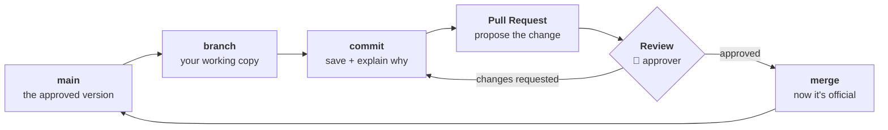

# 07 — GitHub for Non-Coders

> Teaching repository. All examples use fictional data. See [disclaimer](../README.md#-disclaimer).

Git and GitHub explained for people who will never write a line of code — and why an
operations team should care.

---

## The problem GitHub actually solves

Your shared drive right now, honestly:

```
Tender_Response_IMDA.docx
Tender_Response_IMDA_v2.docx
Tender_Response_IMDA_v2_FINAL.docx
Tender_Response_IMDA_v2_FINAL_JT_comments.docx
Tender_Response_IMDA_v2_FINAL_JT_comments_USE_THIS_ONE.docx
Tender_Response_IMDA_FINAL_final.docx
```

Nobody knows which is current. Nobody knows what changed between v2 and v2_FINAL, or who
changed it, or why. Somebody edited one of them last Thursday and there is no way to find
out who, or to undo it.

This is not a filing discipline problem you can solve by trying harder. It is a **tooling**
problem, and software solved it twenty years ago because programmers hit it first and
hardest.

**Git is the solution.** GitHub is Git with a website on top.

| Your shared drive | Git |
|---|---|
| Six files, unclear which is current | **One file**, with complete history |
| "Who changed this?" — unknowable | Every change attributed and timestamped |
| "What changed?" — compare by eye | Exact differences, highlighted |
| "Undo last Thursday" — impossible | Rewind to any point |
| Two people edit at once → one wins | Both changes preserved, conflicts surfaced |
| Approval by email thread | Approval built into the tool, on the record |

---

## The five concepts

Ignore everything else until these are comfortable.

### 1. Repository ("repo")

A project folder with a memory. Every file, every version, every change ever made, and who
made it.

*This repository is one.*

### 2. Commit

A saved checkpoint with a note explaining why.

Not "Ctrl+S" — closer to **signing off on a change with a reason attached**. A good commit
message says *why*, since the *what* is already visible in the change itself:

- ❌ `updated file`
- ✅ `Add PII redaction step to CV screening SOP after Sep incident`

### 3. Branch

A parallel copy where you work without disturbing the live version.

**Ops translation:** taking a photocopy of the master SOP, marking it up freely, and only
merging it back once it is approved. The master stays clean and usable the entire time.
Three people can hold three different branches simultaneously without collision.

### 4. Pull Request ("PR")

A proposal to merge your branch back in — **a formal review and approval step**.

This is the one that matters most for an operations team. A PR gives you:

- A precise view of what is changing, line by line
- Comments on specific lines
- Required approval before anything merges
- A permanent record: who proposed, who approved, when, and why

**That is a change-control process.** You are almost certainly running one already, in
email, badly. GitHub runs it properly, and produces the audit trail as a by-product.

### 5. Issue

A tracked task or question with an owner, labels, and a discussion thread.

**Ops translation:** a ticket. New candidate intake, a BD opportunity, an IMDA milestone —
each becomes an issue with an owner and a status, searchable forever. See
[.github/ISSUE_TEMPLATE/](../.github/ISSUE_TEMPLATE/) for the standardised forms in this
repo.

---

## The workflow, in one diagram



Read it as an approval chain, because that is what it is: **draft → propose → review →
approve → publish**, with every step on the record.

---

## Why markdown

Every document here is a `.md` file — **markdown**, plain text with light formatting.

Why not Word?

| | Word (.docx) | Markdown (.md) |
|---|---|---|
| Show what changed between versions | Poorly | **Precisely, line by line** |
| Readable by AI tools | Awkward | **Natively** |
| Opens anywhere, forever | Needs Word | Any text editor |
| Renders nicely on GitHub | No | **Yes** |
| Merge two people's edits | Painful | Handled |

That second row is the one that connects this file to the rest of the repo. **Markdown in
Git is the ideal format for AI-assisted work** — the AI can read it directly, propose
changes as a PR, and every one of those changes gets reviewed by a human before it counts.

Markdown you need:

```markdown
# Big heading
## Smaller heading

**bold**   *italic*   `code`

- bullet
- bullet

1. numbered
2. numbered

| Column | Column |
|--------|--------|
| cell   | cell   |

> quote

- [ ] unchecked task
- [x] done

[link text](https://example.com)
```

That is genuinely all of it.

---

## How this connects back to AI

This is the payoff, and it is why the AI track and the GitHub track are one course:

| Rung | What it needs | Where it lives |
|------|---------------|----------------|
| **Prompt** | A library of proven prompts | [`PROMPTS.md`](../PROMPTS.md), versioned |
| **Context** | Rubrics, templates, prior examples, an index | [`templates/`](../templates/), [`INDEX.md`](../INDEX.md) |
| **Loop** | Written SOP + verification checklist + external state | [`playbooks/`](../playbooks/), state files |
| **Graph** | Documented topology, gates and audit trail | [`WORKFLOW.md`](../WORKFLOW.md), PR approvals |

Recall Osmani's six loop components: **skills** (codified knowledge) and **external state**
are both just markdown files in a repository. The repo is not where you *store* the AI
work. **The repo is the AI's memory and its rulebook.**

And the PR review step is the human gate from
[rung 4](04-GRAPH-ENGINEERING.md#5-human-in-the-loop-as-a-first-class-citizen) — an
`interrupt_before` on anything reaching the official version. When an AI proposes a change
to an SOP, it opens a PR, and a human approves it before it counts. That is the governance
model, and you get it for free by using the tool normally.

---

## Your first hour

1. **Read** — browse this repo on github.com. Click any `.md` file. Note that it renders.
2. **History** — click *History* on a file. Every change, who, when, why.
3. **Issue** — open an issue using one of the [templates](../.github/ISSUE_TEMPLATE/). It
   is just a form.
4. **Edit** — click the ✏️ pencil on any file, fix a typo, and choose *"Create a new branch
   and start a pull request."* You have now branched, committed and opened a PR from a
   browser, without installing anything.
5. **Review** — ask a colleague to review and merge it.

That is the whole workflow. No terminal, no installation, no code.

---

## The honest caveats

- **The learning curve is real** for the first fortnight. It repays itself; do not pretend
  it is instant.
- **Git is not a document management system** for everything. Use it for *living
  operational documents* — SOPs, templates, prompt libraries, trackers. Not for signed
  contracts or your ATS.
- **Public vs private matters enormously.** This teaching repo is public. Any repo touching
  real client, candidate or project data must be **private**, with access controls. See
  [COMPLIANCE.md](../compliance/COMPLIANCE.md).
- **It will not fix an undefined process.** Git versions your process; it does not invent
  one. If nobody can say who approves what, Git makes that ambiguity visible rather than
  solving it — which is useful, but is not the same thing.

---

← Back to [00 — Start Here](00-START-HERE.md) · Repo [INDEX](../INDEX.md)
