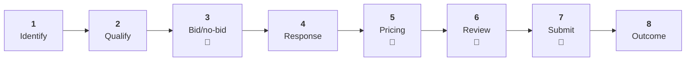
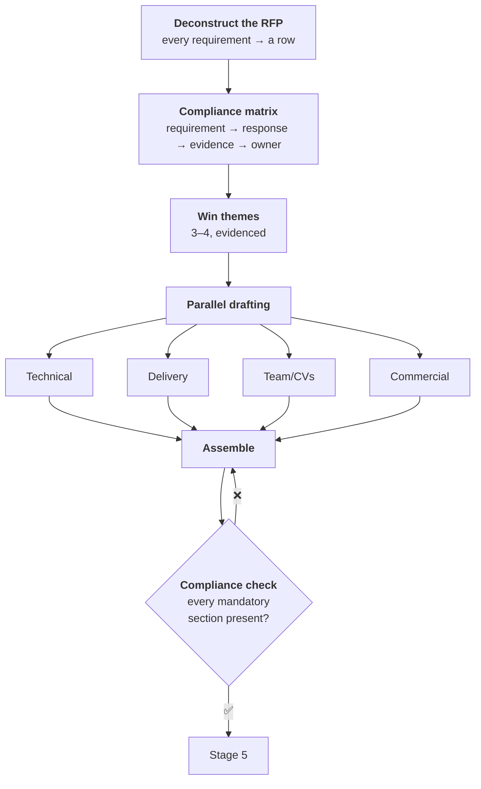

# BIZ-DEV.md — Commercial & Tender Playbook

> ## ⚠️ TEACHING DOCUMENT
> Illustrative playbook in a public teaching repository. All opportunities, clients and
> figures are **fictional**. Thresholds and rates are **placeholders**. Not CGP's operative
> commercial process, and contains no real pricing.

---

## The pipeline



Four gates. Public-sector bidding is expensive — a serious response consumes real senior
time — so **the gates exist to stop you spending it on bids you will not win.**

---

## Stage 1 · Identify

**Owner:** BD Manager · **Cadence:** weekly

Sources: GeBIZ and government procurement portals · agency notices · client relationships ·
market intelligence · framework agreement renewals.

**This is the classic loop candidate.** It is scheduled, rule-based, dull, verifiable, and
it does not happen when the person who does it is on leave. Worked design:
[the Monday morning tender loop](../learn/03-LOOP-ENGINEERING.md#8-worked-example-the-monday-morning-tender-loop).

**Capture per opportunity:** reference · issuing agency · scope summary · estimated value ·
closing date · mandatory criteria · incumbent (if known) · source URL.

---

## Stage 2 · Qualify

**Owner:** BD Manager · **SLA:** 3 working days from identification

### The qualification scorecard

| Dimension | Question | Weight |
|-----------|----------|--------|
| **Capability fit** | Have we delivered this before? | 25% |
| **Commercial** | Is the value worth the bid cost? | 20% |
| **Competitive position** | Incumbent? Do we have a differentiator? | 20% |
| **Relationship** | Do we know the agency? | 15% |
| **Resource** | Can we staff it if we win? | 10% |
| **Risk** | Terms, penalties, clearance requirements | 10% |

**Score 1–5 per dimension. Below 3.0 weighted → default no-bid.**

### Mandatory disqualifiers — check these first

Check before spending any effort on scoring:

- [ ] Do we meet **every** mandatory eligibility criterion?
- [ ] Registration / track record requirements satisfied?
- [ ] Can we meet the security clearance requirement?
- [ ] Is the timeline physically achievable?
- [ ] Any conflict of interest?

**Any "no" is a no-bid, regardless of score.** Failing a mandatory criterion means the
submission is not evaluated at all — the effort is entirely wasted. Check these on day one,
every time. This is the cheapest possible ⭐⭐⭐⭐⭐ mechanical verifier and teams still skip it.

---

## Stage 3 · Bid / no-bid 🚪

**Owner:** BD Director · **Gate:** documented decision before any drafting

| Value | Decision authority |
|-------|--------------------|
| < S$100k | BD Manager |
| S$100k – 500k | BD Director |
| > S$500k | Partner + Finance |

**Record the reasoning either way.** No-bid decisions are as valuable as bids — over a year
they reveal exactly where your capability gaps and market position actually are, which is
information you otherwise pay consultants for.

> **AI prepares this decision; it does not make it.** Bid/no-bid is judgement, money and
> relationships. The loop assembles the analysis; a human decides.

---

## Stage 4 · Response development

**Owner:** Bid Manager · **Structure:** [templates/rfp-response-v1.md](../templates/rfp-response-v1.md)



**The compliance matrix is the single highest-value artefact in the whole process.** One
row per requirement: requirement → where answered → evidence → owner → status. It is how
you avoid losing on a technicality, and it doubles as a **mechanical verifier** — "is every
row addressed?" is a fact, not an opinion.

**Win themes:** 3–4, each evidenced with a specific past delivery. "We are experienced and
reliable" is not a win theme; it is what every losing bid says. A win theme names something
your competitor cannot claim.

**AI assist:** deconstruct the RFP into a requirements matrix (excellent use — tedious,
mechanical, verifiable) · draft first-pass responses from past material · check draft
against the requirements list · summarise long tender documents.

**AI must not:** invent capabilities, certifications, or past projects. This is the highest-risk
failure in the whole document — a fabricated credential in a government tender is not an
embarrassment, it is a misrepresentation. Every claim must trace to something real.

> Use the "no fabrication" prompt pattern: *"If our source material does not evidence a
> claim, write `[EVIDENCE NEEDED]` — do not generate a plausible substitute."*
> Then search the document for `[EVIDENCE NEEDED]` before it goes anywhere.

---

## Stage 5 · Pricing 🚪

**Owner:** Bid Manager + Finance · **Gate:** Finance approval mandatory

> 📝 **All figures below are placeholders.** Real rate cards are 🟠 CONFIDENTIAL and do
> not belong in any public repository. This shows the *structure*, not our pricing.

### Rate card structure (illustrative)

| Band | Role | Day rate (SGD) | Notes |
|------|------|----------------|-------|
| B1 | Junior / Analyst | _[placeholder]_ | 0–3 yrs |
| B2 | Consultant | _[placeholder]_ | 3–6 yrs |
| B3 | Senior Consultant | _[placeholder]_ | 6–10 yrs |
| B4 | Lead / Manager | _[placeholder]_ | 10+ yrs |
| B5 | Principal / Director | _[placeholder]_ | SME |

### Build-up

```
Base cost         (salary or contractor rate)
+ On-costs        (CPF, insurance, leave)
+ Overhead        (allocation %)
+ Delivery risk   (contingency %)
+ Margin          (target %)
= Quoted rate
```

**Checks before submission:**

- [ ] Every rate traced to the approved card
- [ ] **Arithmetic verified** ← mechanical, automate it
- [ ] Margin meets threshold, or an exception is approved
- [ ] Escalation clauses for multi-year terms
- [ ] Payment terms match our standard, or Finance has approved the variance
- [ ] Penalty/SLA exposure quantified
- [ ] Currency and GST treatment correct

**Automate the arithmetic check.** Table sums, rate-card lookups and total reconciliation
are ⭐⭐⭐⭐⭐ deterministic verifiers. A pricing table that does not add up is the most
avoidable way to lose a bid, and it happens regularly because the person checking it wrote it.

---

## Stage 6 · Review 🚪

**Owner:** Bid Manager · Two independent reviews. **Reviewer ≠ author**, always.

| Review | Reviewer | Checks |
|--------|----------|--------|
| **Compliance** | Compliance Reviewer | Every mandatory requirement addressed; no PII; no unsubstantiated claim; terms acceptable |
| **Quality** | Senior not involved in drafting | Does it answer the question? Are win themes clear? Would it score well against the published criteria? |

**Score your own bid against the published evaluation criteria before submitting.** If you
cannot score it well yourself, the evaluator will not either — and unlike them, you still
have time to fix it.

---

## Stage 7 · Submission 🚪

**Owner:** Bid Manager · **Gate:** Partner/Director final approval — `interrupt_before`

- [ ] Format and file-naming per RFP instruction
- [ ] All mandatory forms signed
- [ ] Page/word limits respected
- [ ] **No tracked changes or comments remaining** ← embarrassing and common
- [ ] Correct version of every document
- [ ] Portal submission tested **before** the deadline
- [ ] Confirmation receipt saved
- [ ] Final approval recorded 🚪

**Submit early.** Portal problems at the deadline are not accepted as an excuse by any
procurement authority, and they are entirely predictable.

---

## Stage 8 · Outcome

**Win:** capture what worked · transition to delivery · archive reusable content ·
update the win-theme library.

**Loss:** **request the debrief — always.** Government procurement usually offers one and
most bidders do not take it. Record score breakdown, gaps, competitor position. Feed it
into the next qualification scorecard.

> Over a year, systematically recorded debriefs are the most valuable commercial dataset
> your team can build, and it costs nothing but the asking.

---

## Tracking parameters

| Field | Notes |
|-------|-------|
| Opportunity ID | `BD-YYYY-NNN` |
| Agency / client | |
| Estimated value | Band, not exact, in shared trackers |
| Closing date | |
| Stage | Pipeline stage |
| Bid/no-bid | + reasoning |
| Owner | Named person |
| Win probability | Reviewed at each gate |
| Bid cost to date | **Track this** — most teams don't, and so never learn what a bid costs |
| Outcome | Win / loss / no-bid + debrief reference |

---

## Where to automate first

| Candidate | Verifiable? | Priority |
|-----------|-------------|----------|
| **Tender scanning + summarising** | ✅ Fields, dates, URLs | ⭐ **Start here** |
| **Compliance matrix generation** | ✅ Requirement count | ⭐ **High value** |
| **Pricing arithmetic check** | ✅ Fully mechanical | ⭐ **High value** |
| Mandatory-criteria check | ✅ Checklist | ✅ Easy win |
| First-draft boilerplate sections | ⚠️ Needs review | ✅ Useful |
| Win-theme development | 🚫 Judgement | ❌ Assist only |
| Bid/no-bid decision | 🚫 Judgement | ❌ **Never** |
| Final pricing | 🚫 Commercial judgement | ❌ **Never** |

Note the pattern: **the top three are all mechanical checks, not drafting.** The instinct is
to automate the writing; the value is in automating the checking. Drafting failures are
visible and get caught. Checking failures lose bids silently.

---

**Related:** [rfp-response-v1.md](../templates/rfp-response-v1.md) ·
[WORKFLOW.md](../WORKFLOW.md) · [PROMPTS.md](../PROMPTS.md)
