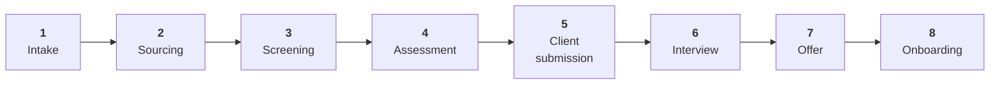
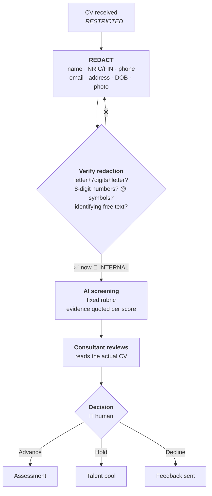

# RECRUITMENT.md — Hiring Playbook

> ## ⚠️ TEACHING DOCUMENT
> Illustrative playbook in a public teaching repository. All candidate references are
> **fictional**. Criteria, SLAs and thresholds are **examples** for adaptation. Not CGP's
> operative process.

---

## The pipeline



**State (the case file), carried throughout:**

```
requisition_id · role_brief · must_haves · nice_to_haves · rubric
candidates[] (by ATS ID only) · stage · assessment_scores
client_feedback · offer_status · onboarding_checklist
```

> 🔴 **The candidate record itself lives in the ATS, never here.** Trackers reference
> **ATS IDs only** — never a name plus an identifier. See
> [data-governance.md §2](../compliance/data-governance.md#2-the-systems-map).

---

## Stage 1 · Intake

**Owner:** Consultant · **SLA:** 2 working days · **Gate:** 🚪 client confirms the brief

Getting this stage right determines everything downstream. Most bad placements are traceable
to a vague brief that nobody challenged.

**Capture:**

| Field | Notes |
|-------|-------|
| Role title + reporting line | |
| **Must-haves** | *Maximum 5.* If everything is a must-have, nothing is |
| Nice-to-haves | Explicitly separated |
| Budget range | Confirmed, not assumed |
| Contract type | Perm / contract / RPO — **determines the routing** |
| Security clearance | Critical for public-sector roles |
| Interview process | Stages, who, how long |
| Success profile | What "great at this job in 12 months" looks like |

**The must-have discipline:** if the client lists twelve must-haves, your actual job in
this stage is to help them rank. A twelve-must-have brief has no candidates, and you find
that out three weeks later.

**AI assist:** draft the role brief from call notes; generate a first-pass rubric from the
must-haves; sanity-check the brief for internal contradictions and for requirements that
may raise fairness concerns.

---

## Stage 2 · Sourcing

**Owner:** Consultant / Researcher · **SLA:** 5 working days to longlist

Channels: internal ATS first (already-known candidates are the cheapest source and the
most commonly overlooked) · referrals · job boards · direct approach · network.

**Target longlist:** 15–25 for perm; 10–15 for contract.

**AI assist:** draft outreach messages (personalise before sending — generic AI outreach is
worse than no outreach and damages the brand) · draft the job advertisement · suggest
adjacent job titles and skill synonyms to widen the search.

> ⚠️ **AI must not** filter candidates *out* at this stage on any inferred characteristic.
> Sourcing is for widening the net, not narrowing it.

---

## Stage 3 · Screening 🔴

**Owner:** Consultant · **SLA:** 3 working days · **The compliance-critical stage**



### The rules

1. **Redact before the prompt.** Every time. [Procedure](../compliance/COMPLIANCE.md#6-the-redaction-procedure).
2. **Same rubric for every candidate in a requisition.** Varying the prompt destroys
   comparability and creates a fairness problem.
3. **AI screens *in*, humans screen *out*.** AI surfaces and structures; a human makes
   every rejection.
4. **Every score quotes evidence** from the CV. "No evidence" is a permitted and encouraged
   answer.
5. **No protected characteristics** — age, race, religion, gender, nationality, marital or
   family status, disability. Instructed explicitly in the prompt.
6. **The consultant reads the real CV** before deciding. The AI summary is an aid, not a
   substitute.

Prompt: [PROMPTS.md → CV screening](../PROMPTS.md#p-01--cv-screening-against-a-rubric).
Scoring sheet: [templates/candidate-eval-v1.md](../templates/candidate-eval-v1.md).

> **Why so strict here?** This is the point where AI touches a decision about a person's
> livelihood. Rule 5 is a legal exposure; rule 3 is the difference between a defensible
> process and one you cannot explain when challenged. If your only account of a rejection
> is "the tool scored them low," you do not have a decision — you have an output.

---

## Stage 4 · Assessment

**Owner:** Consultant · **SLA:** 5 working days

| Component | Purpose |
|-----------|---------|
| Structured interview | Against the rubric — same questions, same order, every candidate |
| Technical validation | Where applicable |
| Reference checks | **Minimum 2**, with consent, before submission |
| Right-to-work verification | ✅ Legitimate identity-document use — via ATS, not AI tools |

**Structured beats unstructured**, consistently and by a wide margin. Same questions, same
order, scored against the rubric immediately after. Unstructured interviews mostly measure
rapport, and rapport correlates with similarity to the interviewer.

**AI assist:** generate rubric-aligned interview questions · structure your notes
afterwards · draft the candidate summary.
**AI must not:** conduct the interview, or score a candidate you did not meet.

---

## Stage 5 · Client submission 🚪

**Owner:** Consultant · **Gate:** Manager review before anything reaches the client

**Submission pack:** anonymised or client-agreed-format CV · assessment summary with
rubric scores · availability and rate/salary expectation · reference status · consultant
recommendation with reasoning.

**Pre-submission checklist:**

- [ ] Candidate has **consented** to this specific submission
- [ ] Formatting matches client requirements
- [ ] No PII beyond what the client has agreed to receive
- [ ] Scores evidenced
- [ ] Manager has reviewed 🚪

**Consent is per-submission, not blanket.** A candidate agreeing to work with you is not
agreeing to be submitted to any client you choose.

---

## Stage 6 · Interview coordination

**Owner:** Consultant · Brief the candidate (format, interviewers, what is assessed).
Debrief **both sides within 24 hours** — feedback decays fast, and a client who cannot
remember why they said no will default to no.

---

## Stage 7 · Offer

**Owner:** Consultant + Manager · **Gate:** 🚪 Manager approves before extending

Confirm: package · start date · contract type · notice period · pre-conditions
(references, clearance, right-to-work).

**Counter-offer:** discuss with the candidate *before* the offer is extended, not after
they receive one. The conversation is far more useful in advance.

---

## Stage 8 · Onboarding (outsourced personnel)

**Owner:** HQ Ops · Critical for outsourced/deployed staff on client programmes.

- [ ] Contract executed
- [ ] Right-to-work verified and recorded
- [ ] Security clearance obtained (public-sector roles)
- [ ] Client-specific onboarding completed
- [ ] **Data protection briefing delivered** ← including AI tool rules
- [ ] Equipment and access provisioned
- [ ] Timesheet process explained
- [ ] Escalation contacts provided
- [ ] Day 1 confirmed with client
- [ ] Day 7 check-in
- [ ] Day 30 check-in
- [ ] Day 90 review

**Day 7 and Day 30 are the ones that get skipped and the ones that matter.** Most early
attrition is visible well before it happens, and is preventable at low cost if someone
asks.

---

## Anonymised evaluation criteria

Default weighting — adjust per requisition, but **fix it before screening begins**, never
after seeing candidates.

| Criterion | Weight | Evidence |
|-----------|--------|----------|
| Core technical / functional skills | 30% | Demonstrated, not claimed |
| Relevant sector experience | 20% | Years + depth |
| Delivery track record | 20% | Outcomes, scale, complexity |
| Certifications / qualifications | 10% | Verified |
| Communication / stakeholder skills | 10% | Interview evidence |
| Availability / logistics | 10% | Notice, location, clearance |

**Scoring:** 5 strong evidence exceeding requirement · 4 meets fully · 3 meets partially ·
2 limited evidence · 1 no evidence · **N/E not evidenced in source** *(distinct from 1 —
"we don't know" is not "they lack it")*.

Keeping N/E distinct from 1 is a small discipline that prevents a large error: absence of
evidence quietly becoming evidence of absence.

---

## Headcount request template

```markdown
REQUISITION: [ID]
Role: ______  Reports to: ______
Type: Perm / Contract / RPO      Headcount: ___
Location: ______   Clearance: Y/N   Budget: ______
Justification: ______
MUST-HAVE (max 5):
1. ___  2. ___  3. ___  4. ___  5. ___
NICE-TO-HAVE: ______
Target start: ______   Approver: ______
```

---

## SLA summary

| Stage | Target |
|-------|--------|
| Intake → brief confirmed | 2 days |
| Brief → longlist | 5 days |
| Longlist → shortlist | 3 days |
| Shortlist → submission | 5 days |
| **Intake → submission** | **15 working days** |
| Interview → feedback | 24 hours |
| Offer → acceptance | 5 days |

---

## Where to automate first

Against the [maturity ladder](../learn/03-LOOP-ENGINEERING.md#9-the-loop-maturity-ladder):

| Candidate | Verifiable? | Start here? |
|-----------|-------------|-------------|
| **PII redaction check** | ✅ Fully mechanical | ⭐ **Yes — build this first** |
| Rubric scoring consistency | ✅ Checkable | ✅ Good second |
| Job ad drafting | ⚠️ Style-dependent | ✅ Low risk |
| Interview note structuring | ✅ Format-checkable | ✅ Good |
| Candidate/client matching | 🚫 Judgement | ❌ Assist only |
| Rejection decisions | 🚫 Never | ❌ **Never** |

**Build the PII detector first.** It is fully deterministic, it is the highest-risk failure
in the whole pipeline, and it protects every other automation you build afterwards.

---

**Related:** [COMPLIANCE.md](../compliance/COMPLIANCE.md) ·
[candidate-eval-v1.md](../templates/candidate-eval-v1.md) · [PROMPTS.md](../PROMPTS.md)
