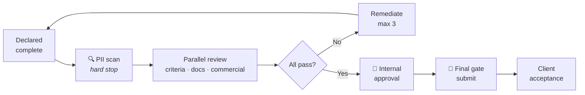

# IMDA-DELIVERABLES.md — Milestone Tracker (Demonstration)

> ## 🚨 FICTIONAL DEMONSTRATION DATA
>
> **Everything on this page is invented for teaching purposes.**
>
> The project below (`PROJ-DEMO-01`), its milestones, dates, acceptance criteria, personnel
> and sign-offs **do not exist** and describe no real engagement with the Infocomm Media
> Development Authority or any other agency.
>
> IMDA is referenced because CGP's outsourcing team works in the public-sector space and
> this repository teaches how such a tracker *would be structured*. **No real IMDA project
> data appears here, and none should ever be committed to a public repository.**
>
> Real project tracking belongs in a **private** repository with access controls. See
> [data-governance.md §5](../compliance/data-governance.md#5-repository-rules).

---

## How this tracker works

Three linked layers:

| Layer | Where | Purpose |
|-------|-------|---------|
| **Milestone definition** | This file | What is committed, when, and what "accepted" means |
| **Work tracking** | GitHub Issues | Live status, discussion, blockers |
| **Sign-off record** | [audit-logs.md](audit-logs.md) + PR history | Who approved what, when |

**The cross-reference is the point.** A milestone here links to its issues; an issue links
back to its milestone. Anyone can trace from a contractual commitment down to the work, or
from a piece of work up to the obligation it serves.

---

## Demo project: PROJ-DEMO-01

> Fictional. Illustrative only.

| Field | Value |
|-------|-------|
| **Project ID** | `PROJ-DEMO-01` |
| **Name** | Digital Services Capability Augmentation *(fictional)* |
| **Type** | Managed resourcing / outsourced delivery |
| **Duration** | 12 months *(demo)* |
| **HQ Ops Lead** | _[placeholder]_ |
| **Delivery Manager** | _[placeholder]_ |
| **Compliance Reviewer** | _[placeholder]_ |
| **Client sponsor** | _[placeholder]_ |
| **Contract value** | _[not disclosed — 🟠 CONFIDENTIAL]_ |

---

## Milestone schedule (fictional)

| ID | Milestone | Due | Status | Owner | Issues |
|----|-----------|-----|--------|-------|--------|
| **M1** | Mobilisation & team onboarding | Month 1 | 🟢 Accepted | _[ ]_ | #1 #2 #3 |
| **M2** | Baseline assessment report | Month 2 | 🟢 Accepted | _[ ]_ | #4 #5 |
| **M3** | Capability framework delivery | Month 4 | 🟡 In progress | _[ ]_ | #6 #7 #8 |
| **M4** | Mid-term review & report | Month 6 | ⚪ Not started | _[ ]_ | — |
| **M5** | Implementation phase 1 | Month 8 | ⚪ Not started | _[ ]_ | — |
| **M6** | Implementation phase 2 | Month 10 | ⚪ Not started | _[ ]_ | — |
| **M7** | Knowledge transfer & documentation | Month 11 | ⚪ Not started | _[ ]_ | — |
| **M8** | Final report & handover | Month 12 | ⚪ Not started | _[ ]_ | — |

**Status key:** ⚪ Not started · 🟡 In progress · 🔵 Submitted, awaiting acceptance ·
🟢 Accepted · 🔴 At risk · ⚫ Blocked

---

## Milestone definitions

### M1 · Mobilisation & team onboarding

**Deliverables:** staffing plan · personnel onboarded and cleared · project governance
charter · communication and escalation plan.

**Acceptance criteria:**

| # | Criterion | Measurable as | Evidence |
|---|-----------|---------------|----------|
| 1 | All roles filled per the staffing plan | Count = agreed headcount | Onboarding register |
| 2 | Security clearance obtained where required | 100% of applicable personnel | Clearance records |
| 3 | Right-to-work verified | 100% | Verification records |
| 4 | Data protection briefing delivered | 100% attendance | Attendance log |
| 5 | Governance charter signed | Signed by both parties | Executed document |

**Sign-off:** Delivery Manager → Client sponsor
**Status:** 🟢 Accepted *(fictional)*

---

### M3 · Capability framework delivery

**Deliverables:** capability framework document · assessment methodology · role
definitions · implementation roadmap.

**Acceptance criteria:**

| # | Criterion | Measurable as | Evidence |
|---|-----------|---------------|----------|
| 1 | Framework covers all agreed domains | Domain checklist complete | Framework doc §2 |
| 2 | Methodology validated with stakeholders | ≥3 sessions, feedback incorporated | Workshop records |
| 3 | Role definitions mapped to framework | Every role mapped | Mapping matrix |
| 4 | Roadmap has dated, owned actions | No action without date + owner | Roadmap §5 |
| 5 | Documentation meets standards | Template compliance check | Reviewer sign-off |

**Sign-off:** Delivery Manager → Compliance Reviewer → Client sponsor
**Status:** 🟡 In progress *(fictional)*

---

## Writing acceptance criteria that work

The most transferable content on this page. **A criterion you cannot mechanically check is
a dispute waiting to happen.**

| ❌ Weak | ✅ Strong | Why |
|---------|-----------|-----|
| "Documentation is complete" | "Every section of the agreed template is populated; no `[TBC]` remains" | Countable |
| "Stakeholders are satisfied" | "≥3 validation workshops held; documented feedback addressed or formally deferred" | Evidenced |
| "The framework is comprehensive" | "All 7 domains in Annex A are covered with defined levels" | Checkable against a list |
| "Delivered on time" | "Submitted by 17:00 SGT on the milestone date via the agreed channel" | Unambiguous |
| "High quality" | "Passes the quality checklist at Annex C with zero criticals" | Defined |

The test: **could a third party with no project context determine pass or fail?** If not,
rewrite it. Ambiguous criteria always resolve in favour of whoever is more assertive at the
review meeting, which is not a basis for a commercial relationship.

> This is the same principle as the [verifier problem](../learn/03-LOOP-ENGINEERING.md#5-the-verifier-problem--the-hard-part):
> push checks down to **mechanical** wherever possible. It applies identically to contract
> management and to agent loops — because both are asking "how do we know this is actually
> done?"

---

## The sign-off process

Governed by [SOP-02](../WORKFLOW.md#sop-02--milestone-sign-off), modelled as a graph in
[learn/04](../learn/04-GRAPH-ENGINEERING.md#8-worked-example-the-imda-milestone-sign-off-graph).



**Every milestone submission must have, before it leaves:**

- [ ] PII scan clean
- [ ] Every acceptance criterion evidenced
- [ ] Version manifest
- [ ] Internal approval per the authority matrix 🚪
- [ ] Final transmission approval 🚪
- [ ] Entry in [audit-logs.md](audit-logs.md)

---

## Issue cross-referencing

Every milestone links to GitHub Issues. Conventions:

**Labels:** `milestone:M3` · `type:deliverable` · `status:in-progress` ·
`priority:high` · `blocked`

**Issue title format:** `[M3] Capability framework — domain mapping matrix`

**In the issue body:**

```markdown
**Milestone:** M3 — Capability framework delivery
**Acceptance criterion:** #3 — Role definitions mapped
**Owner:** [name]
**Due:** [date]

## Definition of done
- [ ] All roles from Annex A mapped
- [ ] Mapping reviewed by [name]
- [ ] Matrix added to framework doc §4
```

**"Definition of done" as a checklist in every issue** is the smallest possible version of
the verifier discipline, and it costs nothing. Use it everywhere.

---

## Risks (fictional)

| ID | Risk | Impact | Likelihood | Mitigation | Owner |
|----|------|--------|------------|------------|-------|
| R1 | Key personnel attrition | High | Medium | Named backups; knowledge documented continuously | _[ ]_ |
| R2 | Clearance delays | Medium | Medium | Start 8 weeks early; maintain a cleared bench | _[ ]_ |
| R3 | Scope creep | High | High | Written change control; nothing verbal | _[ ]_ |
| R4 | Client availability for validation | Medium | Medium | Book workshops at project start | _[ ]_ |
| R5 | Acceptance-criteria dispute | High | Low | Criteria agreed in writing before work begins | _[ ]_ |

**R5's mitigation is the whole point of this document.** Criteria agreed *before* work
starts cost an afternoon. Criteria disputed at sign-off cost weeks and a relationship.

---

**Related:** [audit-logs.md](audit-logs.md) · [WORKFLOW.md](../WORKFLOW.md) ·
[COMPLIANCE.md](../compliance/COMPLIANCE.md)
